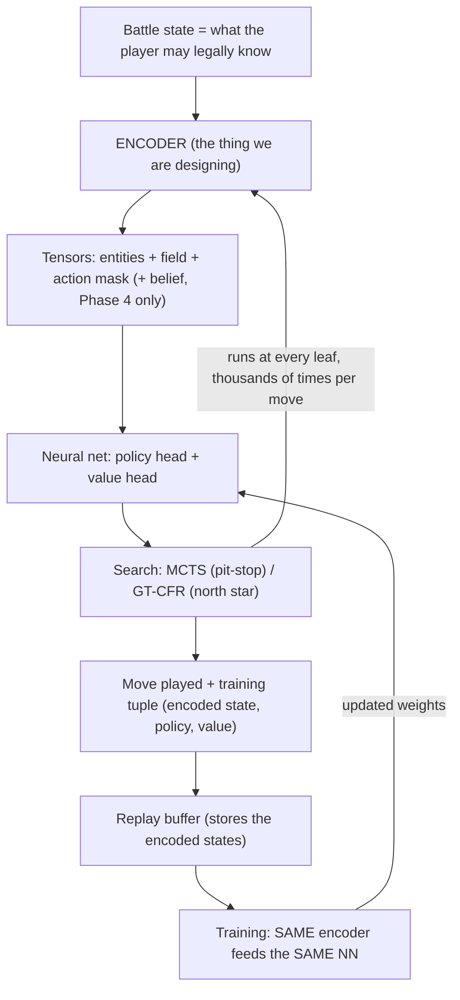

# State Encoding & GT-CFR North Star

**Source:** `agent-transcripts/28098d4e-f344-4ce5-a05e-0c5d2a4e9348/28098d4e-f344-4ce5-a05e-0c5d2a4e9348.jsonl`

---

## User (Turn 1)

I now want to consider the next design point: how to encode the current state in a digestible way for the NN to read. Here's some early thoughts I had on this, and I want to hear if you think this is good or bad or "good enough, but in practice the NN may end up preferring something else, and we just can't know that until we try".

AlphaZero used a HUGE state representation for each state (I can't remember exactly, but it was in one of the old article summary chats, something like every possible move crossed with every possible piece or something?) and that turned out well, so I'm generally going into this with a lack of fear of "this is too large, the NN and the rest of the architecture can't handle this size of state encoding"

Things that need to get encoded (Pokemon's) (and the beliefs about these at each theoretical history as we explore through Monte Carlo to get counterfactual values across all histories for this info set?):
- species for whole team
- moves for whole team
- items for whole team
- EVs and natures for whole team
- current HP percent / status condition / active / back-row / not-brought / fainted
- ALL THE SAME^ for my own team

Other meta-level info that needs to be captured somewhere in the state encoding (but may vary depending on the turn):
- Protect usage for pokemon (e.g. I just used protect last turn, so my new odds of success are 1/3 and the NN should know that)
- Misc environment effects EXISTENCE (terrain, weather, tailwind, Trick room, etc)
- Misc environment effects DURATION (e.g. trick room expires in 1 turn, so I should double protect to stall it out and then I'm faster)
- Perhaps extra guidance on known speeds? I can see from certain info that e.g. Sandstorm hit their pokemon first before it hit mine, so they're faster than me (or technically could be speed tie, but only consider that if it's the same species). This can somewhat be captured in the Pokemon's items (Scarf) / EVs + natures, but I feel that encoding this info somewhere else may be helpful too
- If Pokemon X is unofficially confirmed choice-locked, what moves they're locked into? So some knowledge of previous game history? The info of "that they're choice-locked" is already captured in the pokemon-specific dimension, but "what move are they choice-locked into" isn't captured anywhere else yet
- Anything else? I'm not sure I thought of everything exhaustively

First, I want to clarify the role of this state encoding. This is information that the NN will see to understand what the current state of the game is, including every relevant piece of information that could possibly affect someone's action strategy in this current turn. There are no other consumers of this state encoding besides the NN (the battle simulator will receive a slimmed down version of this, more appropriate for its different role).

Then, I want to ask -- is it okay to encode such critical information for the state in just like a single feature? E.g. Tailwind active + duration is critical to how the game plays out, but this will likely just be one bool for "active" and one float for "duration". Contrast these two features with the massive amount of info that needs to be stored to capture a singular Pokemon's moveset + itemset (with probabilities). Will this critical information get buried in the sea of other information given to the NN?

Some thoughts I had for how to encode the state:
- A dimension for Pokemon seems natural -- each of the opponent's 6 has its own moves + items + abilities + etc, so keeping one dimension reserved for this seems good.
- Thinking about the shape of the arrays, how can we keep the Pokemon dimensions (which are constantly shaped for each pokemon) in conjunction with something like an environment dimension (which will not have the same shape)? E.g. a Pokemon's "vector" may have shape [5, 13, 259] (just making numbers up) and the environment may have shape [318,]. How can we keep these together in the same numpy-like array, practically? Moreover, what if the Pokemon dimension *itself* is not a clean numpy-like array? Like, suppose a single Pokemon's "status" sub-dimension should have shape [35] and the moves dimension should have shape [128]; you can't combine these into something like [2, 35 | 128] in numpy or tensorflow. Is the solution to just flatten everything, so a Pokemon's encoding shape is just [N,], and the whole team is encoded like [6, N]?
- I think it makes sense to do probabilistic encoding of a Pokemon's POSSIBLE moves / items / ev spreads / etc, as this best aligns with a human's understanding of the current game state. My first thought was to have one column for every legal move (FOR EVERY POKEMON), where the value there is the probability that Pokemon X in this battle right now knows that move. But this explodes just the moves out to a bunch of columns -- is this okay? Sort of a similar question to my Tailwind example earlier -- will the NN be good enough to "find the needle in the haystack" and attend to it properly, if that makes sense? So, e.g. Incineroar has a 97% chance from meta priors to know Fake Out, but has a (identically) 0% chance to know Air Slash because it can't even learn that move.
- Expanding this previous logic out, we'd have for a single Pokemon, number of columns equals N1 moves (globally) + N2 abilities (globally) + N3 items (globally) + 25(?) natures + 6 x 32 stat allocations (one-hot encoding for ev spreads, across 6 stats -- is this even the best way to do this, since there's a constraining rule of all stat totals must add to 66?) -- this results in a huge vector for a single pokemon (where by far most entries are zero), and that's before considering more dense information like its status and HP percentage, etc. Is this going to be information overload, or will the NN learn to properly attune to the non-zero elements as much as they are worth?
- Final shape of the state encoding...what is it? I'm a stickler for details, so I want to make sure all the numbers add up correctly and make sense. Do we flatten it all entirely? Seems like there would be some missing value in not stacking two Pokemon on top of each other in that shape (e.g. [6, N] instead of [6*N,]). Then how do we add the environment dimension in? Final shape like [N] or [2, 6, N] or something else?

---

## Assistant (Turn 1)

*[Tools: SwitchMode]*

*[Tools: Glob(docs/article_summary*.md), Read(gt-cfr-theory.md), Read(notes.md)]*

Let me ground myself in your existing theory docs, the AlphaZero notes you referenced, and any existing encoding code before I weigh in.

*[Tools: Grep, Glob(**/*.py), Glob(**/*.{ts,js})]*

*[Tools: Grep, Read(clustering.py)]*

I'm searching through the article summaries for discussions about AlphaZero's state representation, particularly looking for references to plane-based encoding and 8x8x board structures. I should also check the clustering abstraction layer and the current battle state type definitions to understand how state is currently being represented.

*[Tools: Read(types.ts), Grep]*

Let me look at the sim's battle-state types (to ground what's actually available to encode) and check whether encoding was discussed in the prior article-summary chats.

*[Tools: AskQuestion]*

This is a great design question to slow down on — the encoding is genuinely load-bearing (your own `docs/response.md` line 53 flags it as such). I've re-read the theory doc, the article summaries you referenced, and your `meta_priors/clustering.py`. Let me give you opinionated answers, flag the "can't know until you try" parts honestly, and surface the couple of forks that actually matter.

## First, a correction that reframes half your questions

You're remembering two *different* AlphaZero tensors and merging them:

- **Input** (chess): `8×8×119` planes — 8 time-steps of history, each 14 planes (6 own piece types + 6 opponent + 2 repetition), plus 7 constants (side-to-move, move count, castling rights, no-progress counter).
- **Action/policy** (chess): `8×8×73 = 4672` — "every from-square crossed with every move type." This is the *output* head, not the input.

The "every move crossed with every piece" memory is the **action space**, which is a separate design point you'll also have to tackle (your ~100 joint doubles actions + legality masking). Don't conflate it with input encoding.

Why this matters: AlphaZero's input was huge *but it came with a matching inductive bias*. It's a stack of 2D planes consumed by a **CNN**, which exploits translation invariance — a knight fork is a knight fork anywhere on the board, so weight-sharing across the 8×8 grid is "free" generalization. **Pokemon has no spatial grid and no translation invariance.** So "AlphaZero used a huge representation and it worked" should be read as *"huge + structure that matches a CNN worked."* The lesson isn't "don't fear size" — it's **"don't fear size when the architecture's inductive bias matches the structure."** A giant *flat, unstructured* vector into an MLP is the version that actually does bury needles.

The good news: Pokemon has an obvious structure too — it's **entity-centric** (6+6 Pokemon, each an entity with attributes) plus a small set of **global/field** facts. That maps to *set/token* models (DeepSets or a Transformer), not CNNs. Almost every sub-question you asked resolves once you pick "entities + field," so let me go through them.

## "Will critical info (Tailwind = 1 bool + 1 float) get buried?"

This is a real phenomenon, but it's an **architecture** problem, not an encoding-*size* problem. Three things:

1. **Information-sufficiency vs. salience are different.** One bool + one counter is *information-complete* for Tailwind. Whether the net *attends* to it is about architecture and data, not about how many bits you spent.
2. **Don't represent a counter as a raw float next to a sea of 0/1s.** Scale mismatch hurts. Turn-counters are tiny-cardinality (0–8); **one-hot or embed them**. `trick_room: {turns_left ∈ 0..5}` as a 6-way one-hot is far more separable for the net than a single `0.4` float lost among thousands of binary entries. Your own `docs/response.md` line 211 already nails the intuition ("the difference between set Trick Room and not might be one bit... the network needs many examples to learn that bit is diagnostic"). Make the bit *easy*.
3. **Give field its own pathway.** In a flat MLP, field facts are ~20 entries out of thousands and the net must learn to find them (learnable, but data-hungry). If instead the field is **its own token / its own input head** that every Pokemon attends to (or that you concat after pooling the entities), it gets first-class treatment structurally. This is the single biggest mitigation.

So: yes it's fine to encode Tailwind compactly; just (a) one-hot the counter and (b) don't drown it in a flat MLP if you can give it a dedicated pathway.

## The container / shape question — there is no single array, and that's the point

You're tying yourself in knots trying to fit `[6,13,259]` Pokemon and `[318]` field into one rectangular `numpy` array. **Don't.** Real implementations feed the network a **named bundle** (a dict / dataclass / `TensorDict`), and `forward()` takes several tensors. PyTorch doesn't care that they're different shapes.

Within that bundle, the rules are:

- **Per-Pokemon: flatten the ragged sub-parts into one fixed vector.** Your `status[35] ⊕ moves[128] ⊕ ...` can't be a ragged `[2, 35|128]`, correct — so concatenate them into a per-entity vector of fixed length `F`. Then stack to `[6, F]` (or `[12, F]` for both teams). This is clean and is exactly what a shared per-entity encoder wants.
- **Keep the entity axis; don't flatten across Pokemon** (`[12, F]`, not `[12*F]`) *if* you use a shared encoder/attention — that's where weight-sharing and permutation handling live. Flattening to `[12*F]` forces a plain MLP and throws away the "each slot is the same kind of thing" structure.
- **Field/side/global stay separate** and get combined either by (a) concat-after-pooling, (b) a dedicated field *token* prepended to the entity tokens, or (c) broadcast onto every entity row.

So the answer to "final shape: `[N]` or `[2,6,N]`?" is: **a schema, not a shape.** Something like:

```python
obs = {
    "entities":  float[12, F],     # 6 ours then 6 theirs, always to-move-player first
    "ids": {                        # integer ids for embedding lookups (see below)
        "species": int[12], "ability": int[12],
        "item": int[12], "moves": int[12, 4],
    },
    "belief":    {...},             # opponent only; Phase 3+ (see below)
    "field":     float[Ff],         # weather/terrain/TR/gravity + one-hot counters
    "sides":     float[2, Fs],      # tailwind, screens, mega-used, hazards per side
    "scalars":   float[Fg],         # turn#, phase, whose-decision, etc.
    "action_mask": bool[A],
}
```

If you later *want* a pure MLP, you can flatten this whole bundle into one vector at the very end — but keep it structured at the source so the architecture choice stays independent of the encoding.

## Probabilistic encoding: one column per legal move — fine, but two issues

Your instinct (probabilistic, human-aligned) is right. Two concerns with "one column per legal move = P(knows it)":

**(a) High-dim sparse one-hots waste capacity and don't generalize.** For big vocabularies (species ~195, moves ~several hundred, items ~120), the modern answer is **learned embeddings**, exactly like token embeddings in NLP. `species_id → 32-dim`, `move_id → 16-dim`. The net learns that Fake Out and Quick Attack are both priority, that Charizardite-Y and Charizardite-X are related, etc. One-hot can't share anything across moves. This also shrinks your vector dramatically. (One-hot is the "AlphaZero brute force" route; it works, but you have a solo compute budget, so let embeddings buy you generalization.)

**(b) Per-move *marginals* throw away the joint set.** "83% Fake Out, 60% Parting Shot, 55% Knock Off..." can't express "*if* Fake Out *then* usually Flare Blitz." Two very different sets can produce identical marginals. And here's the kicker: **you already built the joint-preserving object** — `ArchetypeSummary` in [meta_priors/clustering.py](meta_priors/clustering.py) gives you top-k *sets* with priors. So the faithful encoding of an opponent slot is:

> a categorical distribution over its top-k **archetypes**, each archetype carried as its own concrete (moves+item+ability+spread) sub-encoding (or a learned archetype embedding).

This isn't just "nicer." It's **structurally required by where you're headed.** Per `docs/gt-cfr-theory.md` §10.1 and `docs/article_summary_7.md` line 95, the GT-CFR value head is a **vector with one CFV per opponent private state** — and "private state" *is* "which archetype." So the belief encoding (distribution over enumerated archetypes) and the value-head output shape (one value per enumerated archetype) are **the same enumeration**. If you encode beliefs as loose per-move marginals, you have no clean enumeration to index the value vector against. The archetype-mixture encoding makes `docs/gt-cfr-theory.md` §12's $\beta$ ("public state + belief ranges over private states") concrete.

You can feed a belief over embeddings cheaply as a **soft expectation**: $e_{\text{slot}} = \sum_i p_i \, \text{emb}(\text{archetype}_i)$, or keep the top-k explicit when the search needs to branch per private state.

## Stat spreads & speed: encode *effects*, not raw config

Your `6 × 32` one-hot for the spread is the weakest idea in your list — drop it. 192 sparse dims that lose the only thing you care about (what *stats* result).

- The 66-point sum-to-budget constraint **doesn't need to be encoded.** You compute the resulting stats; the net just sees numbers.
- **Feed the derived stats**, normalized — the 6 actual level-50 stat values after base + points + nature (per `.cursor/rules/stat-points.mdc`'s formula). The net cares about "does this outspeed Flutter Mane," not the allocation that produced it. Nature can be a small embedding, but it's largely redundant once you feed final stats.
- For the **opponent**, the spread rides along with the archetype (your clustering snaps to centroids — `docs/article_summary_6.md` lines 106–110), so you don't encode a free spread at all; you encode the archetype's stats.
- **Speed specifically** — your instinct to encode it "somewhere else too" is correct and high-value. Precompute and feed *derived* features: each active's effective Speed (after Tailwind/Trick-Room/paralysis/Scarf), and ideally the **pairwise speed order** vs each opposing active. The net *could* re-derive this from raw stats + items + field, but handing it the answer is cheap, decision-critical feature engineering. Pure AlphaZero avoided hand-crafted features on principle — but they had effectively infinite self-play compute on a perfect-info game. For a solo imperfect-info project, a few derived features (speed order, maybe KO-range flags later) are a pragmatic accelerant. Just know it's a deliberate departure from "let the net learn everything."

This same "observed-speed-ordering" evidence you mentioned (Sandstorm chip order revealing who's faster) is really *belief-narrowing evidence* — it should update the archetype posterior (Scarf vs not), which then flows into the encoding through the belief. Encoding it as a derived speed feature is a fine redundant shortcut for the current turn.

## What you're missing (the "anything else?" checklist)

Public, decision-critical things absent from your list:

- **In-battle stat stages** (−6..+6 per stat per active) — Intimidate, Swords Dance, Icy Wind drops. You listed natures/spreads but not live boosts. Huge.
- **Slot position** (left/right) — matters for spread moves, Follow Me / Rage Powder redirection, ally-targeting moves.
- **Volatiles with their own counters** — Protect-counter (you have this), Encore/Taunt/Disable/Torment turns, Perish Song count, Yawn, confusion, Substitute HP, Leech Seed, Wish/Future Sight pending, Slow Start, charging moves.
- **Turns-on-field per active** — drives Fake Out eligibility ("first turn out") and Slow Start.
- **Mega availability per side** (have you already Mega'd? — once-per-battle, per format rules).
- **Item *consumed* flag** (berry already eaten is public info).
- **Team-preview / bring-6-pick-4 status** per opponent slot: `unknown / revealed-active / revealed-back / fainted`. Early on you don't know which 4 of their 6 are even in the game.
- **Choice-lock target** (you flagged this) — encode as "locked move = X" on that slot once inferred.
- **Phase & whose-decision** — normal simultaneous turn vs forced-switch (unilateral) vs team preview (`docs/gt-cfr-theory.md` §13 tree structure).
- **Perspective canonicalization** — always encode from the to-move player's POV (us = slots 0–5, them = 6–11), like AlphaZero flipping the board. And decide team-slot ordering: impose a canonical order (e.g. dex no.) for an MLP, *or* use a permutation-invariant set encoder so order is irrelevant.

## Phasing recommendation (this is the thing I'd lock first)

Your build order (`docs/gt-cfr-theory.md` §14) starts at **Phase 1 = perfect-info AlphaZero**, where there are *no beliefs* — both teams fully revealed, scalar value head. The probabilistic/archetype machinery only enters at Phase 3–4.

So design **one encoder where perfect-info is the degenerate case**: belief = a delta (one-hot) on the single known archetype. Phase 1 feeds deltas and uses a scalar value head; Phase 3+ feeds real top-k mixtures and switches the value head to a vector indexed by that same archetype enumeration. Same schema throughout — you don't rebuild the encoder, you just stop pinning the belief to a delta. This is the cleanest way to avoid building it twice.

## Honest verdict on your "good enough vs. NN-might-prefer-something-else" calibration

- **Architecture matching the structure (entities + field, not flat MLP): not a coin-flip — get this right.** This determines whether "buried needles" is even a problem.
- **Embeddings over one-hot for big vocabularies: strong default, low regret.**
- **Archetype-mixture over per-move marginals: right for where you're going (vector value head), but more upfront work.** A marginal-vector baseline is genuinely "good enough to start, and the net may not care" — this is exactly your "can't know until you try" bucket.
- **Exact per-feature normalization, whether to one-hot vs embed each counter, how many derived features, k for top-k: all empirical.** Pin a reasonable default, move on, tune later.

Before I turn this into a concrete encoding spec (exact field list, dims, embedding tables, the `obs` schema, and where the value-head enumeration plugs in), two forks decide the whole shape of that spec.

 I'm diving deeper into the article summaries to ground my understanding, particularly looking at the archetype abstraction discussion and how AlphaZero's state representation factors into this comparison. The key insight is that Pokemon's structure is fundamentally different from chess or Go — it's a set of entities with attributes, not a spatial grid. This means an MLP on flattened vectors will struggle to keep field-level information from getting lost, whereas a Transformer with entity tokens plus a dedicated field token would naturally preserve that separation. For combining the six Pokemon tensor with environment features, I can either broadcast the global state onto each entity, use a dedicated field token, apply FiLM conditioning, or flatten everything together — each trades off inductive bias versus simplicity. Flattening individual Pokemon into fixed-length vectors is fine; the ragged sub-structures like moves and status effects just get concatenated. For encoding legal moves, a multi-hot vector works but is sparse and high-dimensional; learned embeddings per move would be more efficient.

Now I'm weighing two approaches for representing the opponent: marginal feature vectors (probability distributions over moves, items, abilities) versus archetype mixtures. The marginal approach is interpretable but loses correlations — it can't capture that certain moves tend to appear together with certain items. The archetype approach preserves those joint correlations by clustering opponent sets and encoding each archetype as either a sub-vector or a learned embedding ID, which is cleaner and more expressive.

This connects directly to the GT-CFR value head architecture. In Phase 4 (imperfect information), the value head needs to output one counterfactual value per opponent private state, so if the private state is "which archetype," the belief should naturally be a distribution over those k archetypes. This couples the encoding choice to the network output shape. The marginal probability vector works fine for Phase 1 (perfect information, scalar value), but for GT-CFR you want the belief as a distribution over enumerated private states. I should clarify the phasing here — Phase 1 is perfect information with no belief at all, so the encoding needs to handle both the concrete state (Phase 1) and probabilistic beliefs over archetypes (Phase 3+).

On the user's specific concern about feature imbalance — whether critical info like Tailwind duration gets buried among massive feature sets — there are several mitigations. Architecturally, using entity-tokenized representations with attention means Tailwind isn't just one float among thousands; it's a dedicated token that entities attend to. Even in a flat MLP, the network can learn to isolate diagnostic bits, though it requires more data. Normalization is crucial: duration should be one-hot encoded over small integers (0-8) rather than a raw float, since low-cardinality counters are more separable and prevent magnitude from dominating the signal.

For combining the ragged Pokemon tensor [6,13,259] with the environment vector [318], the key insight is that you don't need everything in a single rectangular array — real implementations use dicts or dataclasses of tensors, and PyTorch's forward pass accepts multiple inputs naturally. For the per-entity processing, you do want a clean rectangular [n_entities, feat] structure so entities can be processed in parallel through a shared encoder, which means flattening each Pokemon's ragged sub-components into a fixed feature vector.

The field/global vector stays separate and combines with the entity stack through one of three approaches: pooling entities then concatenating with the field before an MLP, treating the field as an extra token in a transformer over all entities, or broadcasting the field across every entity row. The final structure is a named bundle of tensors — entities, field, side info, global metadata, action masks — rather than a single monolithic array.

For the probabilistic encoding question about one column per legal move: the core issue is that high-dimensional sparse one-hot vectors are inefficient for large vocabularies, and learned embeddings are the standard solution — mapping a species ID to a 32-dim embedding or a move ID to a 16-dim embedding is far more parameter-efficient than expanding columns for every possible move.

The deeper problem is that per-move marginal probabilities discard correlations between moves; two completely different move sets can have identical marginals. Since I've already built clustering to produce archetype sets with priors, the better approach is to encode the opponent's belief as a categorical distribution over top-k archetypes, with each archetype carried as a concrete set encoding — this preserves the joint structure and aligns with the GT-CFR requirement that the value head operates over private states. The marginal vector is simpler to implement and might work fine in practice, but I won't know until testing.

For stat spread encoding, I should avoid one-hotting 6×32 dimensions entirely. Since spreads snap to cluster centroids as part of the archetype, the spread is already baked in. For my own team's known stats, I should encode the final derived stats directly — the actual Speed, bulk, and other values at level 50 after applying base stats, EV points, and nature. This is far more semantically meaningful than raw point allocations and automatically respects the sum-to-66 constraint. If I must encode points separately, just use 6 normalized floats plus a nature embedding; the network will learn what matters without needing explicit constraint encoding.

The key insight is encoding effects rather than raw configuration. Speed especially deserves precomputation — I should feed the actual Speed stat and explicit speed comparisons against each opponent (whether I'm faster under current Tailwind or Trick Room). While AlphaZero avoided hand-crafted features, I have finite compute, so a few derived features like speed order and KO ranges are pragmatic wins.

For the final shape question, if I use a per-entity encoder or attention mechanism, I should keep the structure as [2,6,N] or [12,N] so the encoder sees each Pokémon as a unit and attention can relate them. Flattening destroys permutation structure and weight sharing. For a pure-MLP baseline, flattening to one big vector is acceptable and simplest, but I lose the inductive biases. The real answer is to use a dict bundle rather than forcing everything into a single array shape.

Beyond what the user mentioned, I need to encode stat stages (boosts and drops from moves like Swords Dance or Icy Wind), which are public and decision-critical. Field and side conditions go deeper too — screens, Tailwind per side, Trick Room, Gravity, Safeguard, Mist, and various volatile statuses with their own counters like Substitute, Leech Seed, Encore, Taunt, Disable, Torment, Protect-counter, Perish Song counter, Yawn, Confusion, and Choice lock. I also need Mega availability per side, position information (left/right matters for spread moves and Follow Me), last move used, whether a Pokémon moved this turn (for Fake Out eligibility), and turns-on-field counters.

For items, I track what's known for my own team versus beliefs about the opponent's, plus whether a berry was already consumed. Ability information is partially revealed. HP should be encoded as both a fraction and exact value for my own team, and status as a one-hot vector with counters for poison and sleep. For the opponent's team preview, I need to track which of their 6 Pokémon are actually in play (they bring 6 but pick 4), encoding each as revealed, active, in back, unknown, or fainted.

I should canonicalize the frame of reference — always encode from the perspective of whoever's about to move, so the representation stays symmetric. For the team slots themselves, since they have no inherent order, I can either impose a canonical ordering by Pokédex number or use a permutation-invariant encoder like attention, adding position info only where it actually matters.

On the user's point about AlphaZero's large representation: they're partly right. Size itself isn't the problem — modern networks handle thousands of features fine. But AlphaZero's size came *with* structure: spatial planes exploited by CNNs with weight sharing and translation invariance. The real risk is unstructured size, a giant flat sparse vector into an MLP that wastes capacity and buries the signal. So the lesson is size plus right structure works well; size without structure is the needle-in-haystack problem they intuited. Also worth clarifying that AlphaZero's huge representation was mostly the action/policy space, not the input — the "every move crossed with every piece" thing is the policy head design, separate from input encoding, though both need careful attention. The critical coupling is that the value head is a vector over information sets, which only makes sense if beliefs are encoded as an explicit distribution over enumerated archetypes — that's what grounds the whole approach.

In practice, the belief encoding enumerates (or samples) the opponent's plausible joint private states, and the value head returns one counterfactual value per enumerated state. Player of Games adds a subtlety: the value network takes the public belief state (public info plus belief ranges as per-infoset reach probabilities) and outputs CFVs for each player's info sets. For the user's design level, thinking of belief as a distribution over opponent private configs matches their clustering work and is the right mental model. The phasing matters too — the build order goes from perfect-info AlphaZero with scalar values, then stochastic, then imperfect-info determinized IS-MCTS with sampled beliefs, and finally GT-CFR with explicit vector value heads and beliefs.

I should recommend designing the encoder so perfect-info is the degenerate case where belief is a delta distribution on the known set, letting the same schema scale through all phases. For Phase 1, just feed delta beliefs and the architecture handles it uniformly.

Now I'm laying out the practical container structure — a typed schema like a Python dataclass or TensorDict that bundles entities with their IDs, belief distributions over archetypes, field state, and per-side information, all fed together to the network.

The real question is whether to present a comprehensive design analysis addressing their feedback points, or ask clarifying questions first. They're asking for evaluation and discussion, not implementation, so I should give thorough written feedback on each aspect and surface the key architectural forks — like whether to use a flat MLP baseline versus entity/attention, or how to encode opponent beliefs — rather than jumping straight to a plan. I'm leaning toward giving strong recommendations rather than just listing options back to them—pick sensible defaults and explain the reasoning, then ask one focused question about whether to formalize this into a written spec and which phase to target first. That respects their exploratory tone while still moving toward concrete next steps.

For the structure, I'll organize around the core architectural insight (entity tokens rather than spatial planes), then work through the container shape, belief encoding approach, stat representation, and what's missing. I'll include a concrete schema proposal and be honest about which parts are "can't know until you try." The user values precision and wants the numbers to add up, so I'll keep each section tight but detailed. I'm pulling together references from the docs and code to ground the analysis, then I need to narrow down the key architectural decision: whether to start with a flat MLP baseline for speed, add entity-token attention from the beginning for better structure, or use a hybrid approach with per-entity encoders. I also need to decide on belief representation—marginal probabilities, explicit archetype mixtures that align with the value head, or deferring that design until Phase 3 when beliefs become critical.

Given the exploratory tone, I'm leaning toward asking two focused questions to converge: first, whether to design the encoder for Phase 1 perfect-info only or build the full belief-aware schema now, and second, which architectural style makes sense. These two choices will shape the entire spec.

I'll present my recommendation clearly and let them confirm or override it, marking the preferred option in the question. I should also be precise about the AlphaZero numbers—chess uses 119 input planes and a 4672-element policy, Go uses 19×19×17—and flag which design decisions are knowable upfront versus which ones require experimentation.

Now I'll draft the response with the two key questions via the tool.

*[Tools: AskQuestion]*

Both of your pivots are good instincts, and your conceptual question at the end is the sharpest one in this whole thread — it's the thing that actually determines whether you ever need probabilities in the encoding at all. Let me answer that first, because it reframes the meta-priors question too, then teach you transformers properly, then come back to meta-priors.

## Your conceptual question is the crux: distribution-in-the-input vs. concrete-history

You asked: *should a Pokemon be a probability distribution over moves/items/spreads, or is it "for a given history at this info set" where everything is known and the probability lives one step up (the probability of history h)?*

There are exactly two schools here, and **you just independently re-derived the fork between them.** Recall the counterfactual value (theory doc §7.1):

$$v_i(I, a) = \sum_{h \in I} \pi_{-i}^{\sigma}(h)\, \cdot\, u_i^{\sigma}(h \cdot a)$$

Read that sum literally: an info set $I$ *is* a bag of concrete histories $h$. In each individual $h$, the opponent's Incineroar has one specific set — everything is known. The probability is the **weight** $\pi_{-i}(h)$ on each concrete world, sitting *outside* the per-world value $u(h)$. So your phrasing — "pretend everything is known for a given history, and the probabilistic nature comes the step before" — is **literally the definition of the CFR value.** Your intuition matches the math.

The two schools differ in *where you pay for the hidden info*:

- **School B (yours): sample concrete worlds.** The network only ever sees fully-known states (scalar value head, exactly like perfect-info). The distribution lives in the *search/sampling layer*: you sample histories $h$ from the belief and Monte-Carlo estimate the sum. This is determinization / IS-MCTS (Phase 3) and MCCFR (the sampled form of CFR, theory doc §9.1).
- **School A: put the belief in the input.** The network sees the whole distribution and emits a **vector** of values, one per private state (PoG/DeepStack, theory doc §10.1). Done because (1) one forward pass gives all the CFVs the regret update needs, and (2) under *depth-limited* search the continuation value below a leaf genuinely depends on the ranges, which a single concrete-world value can't express.

Now the part that matters most for you:

**For Phase 1 (perfect info), which you chose, the question dissolves — there is no hidden info, so everything is known by construction. No distributions anywhere, scalar value head. Your "pretend known" framing isn't a pretense; it's the truth.** So encode concrete values only.

And the crucial subtlety for *later* phases, so you don't fear School B: **strategy fusion is not caused by evaluating concrete worlds.** It's caused by letting the *search pick a different action in each sampled world* (determinized MCTS maxes per-world, as if you could tailor your move to info you don't have — theory doc §4). CFR/MCCFR sample concrete worlds *too*, but they keep **one strategy per info set** and only use the samples to *estimate* the value sum — so they're fusion-free. In other words: sampling concrete worlds (your School B encoding) is compatible with both the fusion-y baseline (IS-MCTS, Phase 3) and the fusion-free target (MCCFR-style CFR). The fusion lives in the algorithm wrapped around the encoding, not in the encoding.

Takeaway: **build the encoder to take concrete, known values.** Phase 1 needs exactly that. School B keeps it that way forever (probabilities move into the search/sampler). Only if you later commit to the full PoG vector-value-head does the belief move into the input — and that's a deliberate, separable upgrade.

This also means **your meta-priors module is not even on the Phase 1 critical path** (both teams are revealed in Phase 1). More on that below.

## Transformers, for someone who already groks MLPs

The one-sentence version: **a Transformer is your MLP, plus a learned step that lets the items in a set exchange information with each other.** That exchange step is "attention." Everything else you already know.

### The problem attention solves

You have 12 Pokemon, each a fixed vector, stacked `[12, F]`. You want each Pokemon's representation to be *contextualized by the others* — "my Incineroar is worth less if the opponent has a revealed Fighting type." With an MLP you'd flatten to `[12*F]` and let a dense layer mix everything, but that (a) forces a fixed slot order, (b) learns a *separate* weight for "slot 3 feature 7 → slot 9 feature 2" with no sharing, and (c) blows up parameters with entity count. Attention fixes all three by making the mixing **content-based and weight-shared**.

### The mechanism: query, key, value

For every token (Pokemon) vector `x_i`, project it three ways with learned matrices (these are just `nn.Linear` layers — your MLP knowledge):

- **query** `q_i = x_i W_Q` — "what is this token looking for?"
- **key** `k_i = x_i W_K` — "what does this token advertise about itself?"
- **value** `v_i = x_i W_V` — "what content does this token contribute if attended to?"

The relevance of token `i` to token `j` is the dot product `q_i · k_j` (high when `i`'s query aligns with `j`'s key). Scale by `sqrt(d_k)` (keeps dot products from exploding as dimension grows — the "scaled" in scaled dot-product attention), softmax over `j` to get weights that sum to 1, then each token's output is the weighted sum of everyone's *values*:

$$\text{Attention}(Q,K,V) = \text{softmax}\!\left(\frac{QK^\top}{\sqrt{d_k}}\right) V$$

It's a **soft, differentiable dictionary lookup**: the query looks up the most relevant keys and retrieves a blend of their values. When Q, K, V all come from the same set, it's **self-attention** (the team attending to itself).

Here it is from scratch — deliberately tiny so you can see there's no magic:

```python
import torch
import torch.nn.functional as F

def self_attention(x, w_q, w_k, w_v):
    # x: [n_tokens, d_in] -- e.g. 12 Pokemon, each a d_in-length vector.
    # Project every token into query / key / value spaces (learned linear maps).
    q = x @ w_q                          # [n, d_k]  "what each token is looking for"
    k = x @ w_k                          # [n, d_k]  "the match-key each token offers"
    v = x @ w_v                          # [n, d_v]  "the content each token contributes"
    d_k = q.shape[-1]
    # Relevance of token i to token j = dot(q_i, k_j), scaled to tame large dims.
    scores = (q @ k.T) / (d_k ** 0.5)    # [n, n]  the full attention matrix
    # Turn each row into weights that sum to 1 (how much i attends to each j).
    weights = F.softmax(scores, dim=-1)  # [n, n]
    # Each token's new vector is a weighted blend of all tokens' values.
    out = weights @ v                    # [n, d_v]
    return out, weights
```

That `weights` matrix is fully interpretable — you can literally read "Incineroar attended 0.4 to the opposing Landorus."

### Three more pieces and you have the whole thing

1. **Multi-head.** Do the above `h` times in parallel with smaller, independent `W_Q/W_K/W_V`, then concat and project. Each "head" can specialize — one learns speed relationships, one learns type matchups, one learns "who threatens whom." Cheap, and empirically essential.

2. **The Transformer block = attention + your MLP, with residuals.** A block is literally:

$$z = x + \text{Attention}(\text{LayerNorm}(x)), \qquad \text{out} = z + \text{MLP}(\text{LayerNorm}(z))$$

The `MLP` (called the feed-forward network) is applied **independently to each token** — it's exactly the MLP you already know, just run per-Pokemon. So a Transformer is: *attention mixes information across Pokemon, then a per-Pokemon MLP digests it*, repeated `N` times. **Attention is the only operation that moves information between entities; everything else is your familiar per-token MLP.** Residual connections (`x +`) and LayerNorm are just the plumbing that makes deep stacks trainable.

3. **Permutation equivariance — the property that makes this perfect for a team.** Attention has no built-in notion of order: permute the input rows and the outputs permute identically, nothing else changes. For an *unordered* set of 6 Pokemon, that's exactly right — slot order is arbitrary and shouldn't matter. (Contrast LLMs, where word order is meaningful, so they *add* positional encodings. You'd deliberately **omit** positional encodings on the team axis, and instead mark "active vs back" and "my side vs theirs" as **features inside each entity vector**, not as positions.) After you mean-pool or use a CLS token, the whole thing becomes permutation-*invariant* — feed the team in any order, get the same answer. An MLP on a flattened vector can only fake this with heavy data augmentation.

### The practical version for your battle state

In real code you don't hand-roll attention; you use `torch.nn.TransformerEncoder`. Here's your actual use case — entities + a field token + a CLS token → pooled → two heads — which also shows how the "keep ragged things separate" idea cashes out:

```python
import torch
import torch.nn as nn

class BattleEncoder(nn.Module):
    def __init__(self, entity_dim, field_dim, n_actions,
                 d_model=128, n_heads=4, n_layers=3):
        super().__init__()
        # Each Pokemon's raw (possibly concatenated-from-ragged-parts) vector -> model width.
        self.entity_proj = nn.Linear(entity_dim, d_model)
        # The global/field vector becomes ONE token of the same width (weather, TR, etc.).
        self.field_proj = nn.Linear(field_dim, d_model)
        # A learned "summary" token that will pool the whole battle (like BERT's [CLS]).
        self.cls = nn.Parameter(torch.randn(1, 1, d_model))
        # Standard transformer blocks: attention across tokens + a per-token MLP.
        block = nn.TransformerEncoderLayer(
            d_model=d_model, nhead=n_heads,
            dim_feedforward=4 * d_model,  # this is the per-token MLP's hidden size
            batch_first=True,             # tensors are [batch, tokens, features]
        )
        self.transformer = nn.TransformerEncoder(block, num_layers=n_layers)
        # Phase 1: a scalar value head (no belief vector needed) and a policy head.
        self.policy_head = nn.Linear(d_model, n_actions)
        self.value_head = nn.Linear(d_model, 1)

    def forward(self, entities, field, entity_valid=None):
        # entities: [B, 12, entity_dim] ; field: [B, field_dim]
        B = entities.shape[0]
        ent = self.entity_proj(entities)                 # [B, 12, d_model]
        fld = self.field_proj(field).unsqueeze(1)         # [B, 1, d_model]
        cls = self.cls.expand(B, -1, -1)                 # [B, 1, d_model]
        # Token sequence = [CLS] + [field] + 12 Pokemon = 14 tokens.
        tokens = torch.cat([cls, fld, ent], dim=1)       # [B, 14, d_model]

        mask = None
        if entity_valid is not None:
            # src_key_padding_mask: True means "ignore this token as a key".
            # CLS and field are always visible (False); fainted/unknown mons get True.
            always_on = torch.zeros(B, 2, dtype=torch.bool, device=entities.device)
            mask = torch.cat([always_on, ~entity_valid], dim=1)  # [B, 14]

        # Every (valid) token attends to every other valid token.
        h = self.transformer(tokens, src_key_padding_mask=mask)  # [B, 14, d_model]
        pooled = h[:, 0]                                  # read out the CLS token, [B, d_model]
        return self.policy_head(pooled), self.value_head(pooled)
```

This directly resolves the things you were stuck on:

- **Ragged sub-vectors** (`status[35]`, `moves[128]`): you still concatenate them into each Pokemon's `[entity_dim]` vector. The transformer never sees the seams. The field/global lives in a *separate* tensor and becomes its own token — no need to cram it into the same rectangular array, which was the thing tying you in knots.
- **Buried needle (Tailwind):** the field is a *peer token*, not one float among thousands. Every Pokemon attends to it directly; it cannot get drowned out structurally.
- **Unordered slots + variable count:** permutation equivariance handles arbitrary order; `src_key_padding_mask` handles fainted/unknown/not-brought slots.

**Libraries:** for this project, raw PyTorch (`nn.TransformerEncoder`, `nn.MultiheadAttention`) is the right tool — small, custom, trained from scratch. HuggingFace `transformers` is for *pretrained* LLMs and is not what you want here. The whole encoder above is ~40 lines.

One honest caveat so you're not blindly accepting: transformers are slightly fiddlier to train than MLPs (LayerNorm placement, learning-rate warmup, mask bugs are easy to introduce). Since you chose **Phase 1 only** and you know MLPs cold, a totally legitimate path is to ship a flat-MLP encoder *first* (the structured `obs` bundle flattens fine), confirm the whole AlphaZero loop works end-to-end, then swap in this encoder behind the same interface. The encoding schema doesn't change; only the consumer does.

## On rewriting meta-priors: your instinct is right, with one caveat

You've correctly diagnosed that **archetypes were doing two jobs**, and you only like one of them:

1. **Finite enumeration** — turning the infinite (moves × items × spreads) space into "one of k sets" so the CFR sum/vector-value-head has a fixed index. *This job is only needed for School A (belief-in-input, vector head).* If you go School B (sample concrete worlds — which is also exactly Phase 1's "everything known"), **you don't need a fixed k at all.** You need a *sampler*: `P(opponent private state | observations)`. Sampling kills the "how many sets does Incineroar have" anxiety, because you never have to commit to a number.
2. **Smoothing** — clustering also *generalizes over sparse data*. This is the caveat: the reason "what defines an archetype is loose" feels uncomfortable is the same reason it's useful — it imposes structure on a fuzzy continuum where you have few samples. If you drop clustering and just condition empirically (filter the raw sets matching your observations, read off frequencies — which is **exactly what your Streamlit conditional panel already does**), you keep the part you love, but you'll hit **sparsity holes**: condition on three observations and you might have two matching sets, or zero. So you'll need *some* smoothing/backoff to replace what clustering gave you — e.g. similarity-weighted (kernel) counting over sets, a factored marginal fallback when the joint is empty, or a tiny autoregressive set model. That's the real design work of the rewrite.

So the rewrite I'd point you toward: **a conditional sampler over real sets** (keep the empirical conditioning you like; replace hard clusters with similarity-weighted / smoothed sampling), not a re-clustering. But — important — **this is decoupled from Phase 1 and from the encoder.** Phase 1 reveals both teams, so it touches neither meta-priors nor beliefs. You can build and validate the entire Phase 1 encoder + AlphaZero loop *before* resolving the meta-priors question, and you'll understand the belief requirements far better once the perfect-info version is running.

Given all that, where do you want to point next?

 The user wants to focus on Phase 1 with perfect information only, setting beliefs aside for now. They're asking me to explain how transformers actually work with concrete PyTorch examples, starting with a simple transformer implementation—they're already comfortable with MLPs, so I can build from there.

They're also reconsidering the meta priors module entirely. They like the idea of querying real data to update distributions conditionally ("if I know this property, how does the distribution shift?"), but they're rejecting the pre-defined archetypal sets because those feel too rigid and arbitrary. The real insight is their question about state encoding: should a Pokémon be represented as a probabilistic distribution over moves/items/EV spreads, or should the probabilistic nature live at the history level instead—where for a given information set, I can treat those properties as known and only ask "what's the probability this history led here?" This is the core tension in how beliefs and value networks interact in imperfect-information game solving. Option B is exactly what causes strategy fusion — if the network evaluates a fully concrete history and returns a scalar value, averaging those values over sampled worlds is the determinization approach that fails because you can't actually play different actions in different worlds you can't distinguish. I need to be more careful about what strategy fusion actually means here: it's about whose strategy is being optimized and whether the search gets to choose different actions across determinized worlds, versus just evaluating a leaf value in a concrete world.

The key distinction is that in CFR, you can decompose into concrete histories and sum them, but the strategy $\sigma$ used to evaluate the value must be a behavioral strategy defined at the info-set level — it has to be identical across all histories in the same info set. This constraint prevents strategy fusion, not necessarily the presence or absence of beliefs in the network input. So the real question is what the value network actually needs to output in GT-CFR or PoG, and whether beliefs are required for that.

In DeepStack and Player of Games, the counterfactual value network does take belief ranges as input because the CFV of your info set depends on the opponent's strategy, which at equilibrium depends on their belief about your range, which depends on your strategy — it's a fixed point. When you do depth-limited search and plug in a value network at the leaves, that leaf value assumes equilibrium play below, and that equilibrium depends on the ranges at the leaf. Different ranges lead to different equilibria and thus different CFVs, so ranges must be in the input. The network returns a value for each of your possible hands given both range distributions.

This means Option A (belief in input, vector output) is what PoG and DeepStack actually use because the continuation value genuinely depends on the ranges. However, Option B is legitimate for Phase 1 and Phase 3 — in Phase 1 with perfect information, there's only one history per info set, so the belief is a delta function, the input is a concrete state, and the value is scalar, with no fusion because there's no hidden information.

In Phase 3 with determinized IS-MCTS, you sample concrete worlds and evaluate each as perfect-info, then average — this does suffer from strategy fusion, which the theory explicitly acknowledges. So Option B corresponds to Phase 3, a known-imperfect baseline. Phase 4 with GT-CFR and CVPN requires moving beliefs into the input and making the value head a vector specifically to eliminate strategy fusion. The user's question about whether to capture a Pokémon as a probabilistic distribution or pretend everything is known is phase-dependent — they've chosen Phase 1, where the answer is to pretend everything is known with a scalar value and no distribution in the input. The deeper insight is that the two options map exactly to the Phase 3 versus Phase 4 distinction, and Phase 4 puts beliefs in the input to kill strategy fusion. The user's framing about probabilistic history coming from a prior step is exactly the determinization/IS-MCTS approach of Phase 3, which is valid but has a known ceiling due to strategy fusion.

For the meta-priors rethink, the user wants to drop hard archetypes because they're loosely defined and can't pin down how many sets Incineroar has, preferring instead to keep conditional querying like "given item=X, how does the distribution update?" In Phase 1 with perfect information, the meta-priors module isn't even used in encoding since both teams are revealed — meta-priors only matter for Phase 3 onward when beliefs come into play. But the user is clearly thinking ahead about how beliefs will work. Instead of clustering into discrete archetypes, they could represent the belief as a conditional probability model over the moves, item, ability, and spread space that's queryable given observations — either as a factored marginal model with learned correlations, or as a non-parametric empirical conditional that filters raw team data.

The key insight is that archetypes were just an abstraction to make the history-sum finite for CFR. Without pre-clustering, you need another way to enumerate or sample histories in an info set. The elegant solution: sample concrete teams from the empirical conditional distribution during search (MCCFR-style determinization) rather than enumerating k fixed archetypes. This aligns perfectly with the user's instinct — keep a queryable conditional distribution from real data and sample concrete private states from it, where each sample becomes a concrete history with everything known, which is exactly their "pretend everything is known for a given history" framing.

There are two fundamentally different approaches to hidden information: belief-in-the-input (where the NN sees the distribution and outputs a value per private state, requiring enumerable archetypes) versus sample-concrete-worlds (where the NN sees a fully concrete world and outputs a scalar, with the distribution living outside the NN in how you sample). The second approach is the user's Option B and doesn't require pre-defined archetypes — just a sampler from the queryable conditional distribution.

The user's instinct toward Option B is coherent and maps to the determinization/sampling family. For Phase 1 it's exactly right, and for later phases, sampling concrete worlds from a conditional distribution lets them keep the benefits of meta-priors while dropping hard archetypes. The tradeoff is the strategy-fusion ceiling in naive IS-MCTS, though proper MCCFR with info-set constraints mitigates this. I need to clarify the distinction carefully: in IS-MCTS determinization, each sampled world gets optimized independently, which creates fusion, but in CFR you don't optimize per-world — you're building a strategy that works across the distribution. The key insight is that range-dependence in continuation values is why PoG uses vector inputs—a concrete-world scalar net can't represent how leaf values depend on the belief ranges. For depth-limited search with a learned leaf value, you need belief-in-input for correctness, but for full-depth search to terminals, sampling concrete worlds works perfectly. So for Phase 1, Option B (concrete world, scalar value) is exactly right, and the strategy fusion issue depends entirely on which search algorithm wraps around the sampling, not the encoding itself. I should give the user a clean answer for their immediate decision while sketching the forward path: drop the archetypes and use conditional querying instead, then explain that the transformer deep-dive is the big task ahead. Query, key, and value projections are learned transformations of each input, then attention scores measure relevance between queries and keys, scaled and normalized into weights that mix the values. In matrix form, this becomes a clean operation: softmax of the scaled query-key dot products times the values. Multi-head attention runs this in parallel with different projection matrices so the model can simultaneously learn different types of relationships—like one head focusing on type matchups while another tracks speed differences. The key insight is that attention has no inherent ordering, so permuting the entities doesn't change the computation. Field token gets prepended so it's a peer in attention, solving the burial problem. Then I stack transformer blocks, pool the output, and feed it to MLP heads for policy and value. For implementation, PyTorch's `TransformerEncoder` is the right fit here—small and custom rather than a pretrained LLM—with `key_padding_mask` to handle variable team sizes. I should show two examples: a minimal from-scratch attention implementation to demystify the mechanism, then a practical version using `nn.TransformerEncoder` with masking for the actual use case.

Writing attention code... Completing the forward pass...

The pooled CLS token gets passed through separate heads to produce policy and value outputs. I'm verifying the mask semantics are correct—True means ignore, so we flip the entity_mask to get the padding mask, while CLS and field tokens always attend. With d_model=128 and 4 heads, that's 32 dimensions per head, which divides evenly.

This architecture directly addresses their concerns: ragged entity vectors don't matter since the transformer just processes whatever features are concatenated; the field token is its own peer in the sequence so it won't get buried; attention is permutation-equivariant so slot order is irrelevant; and the padding mask handles variable team sizes. Since they're starting with Phase 1 to build intuition, I should focus on explaining the core conceptual question about whether the distribution is in the input features or learned through attention. For Phase 1 with perfect information, there's no hidden state at all — both teams are fully revealed, so I don't need to encode any distributions. Everything is known by construction. But your instinct about the general design is spot-on: the "probabilistic nature comes from weighting concrete histories" is exactly how CFR decomposes an info set mathematically, and it's the foundation of the sampling/determinization approach (which Phase 3 and MCCFR use). The alternative — encoding distributions directly in the input with a value head — is the PoG/DeepStack school, which becomes relevant later when you need to handle hidden information efficiently.

The crucial distinction I want to clarify: strategy fusion isn't caused by evaluating concrete worlds; it comes from letting the search optimize different actions per world. CFR avoids this by maintaining one strategy per info set even while summing over concrete histories. So you could sample concrete worlds and stay fusion-free as long as your search respects info-set constraints like CFR does, rather than solving each world independently as pure MCTS would.

Now connecting this back to the meta-priors question: if you shift to sampling concrete histories, you'd need a conditional sampler over opponent private states given observations—not fixed archetypes. Your archetypes were really just a finite enumeration to make the sum tractable and index a value head; sampling removes that constraint. What you already like (conditional querying to update distributions) is exactly what a conditional sampler does, and your Streamlit app already does empirical conditioning. The tradeoff is honest though: archetypes provided smoothing to handle sparse data, so dropping them for empirical conditionals gains fidelity but requires handling sparsity another way—maybe through factored marginals or a small generative model as fallback.

For Phase 1 this doesn't matter since it's perfect information, so you can defer the meta-priors rewrite, but the conceptual direction (sampler over archetypes) is sound to keep in mind.

I'm confident I have a complete answer here and don't need additional research—I can explain transformers and write the PyTorch code from knowledge, and I've already grounded the meta-priors discussion in what I've read from your codebase.

Since you're in learning mode and want to understand before committing, I'll provide the full explanation and then ask whether you'd rather prototype the transformer encoder for Phase 1 first or tackle the meta-priors rethink. I'm verifying the permutation equivariance property—if I shuffle the input rows, the attention mechanism shuffles outputs identically, and the per-token FFN preserves that equivariance. After pooling, the output becomes invariant to input order, which is exactly what we need for unordered teams. I'll avoid positional encodings on the team axis since order doesn't matter, unlike language models where word sequence is crucial. Now I'm ready to write the full answer with clear code examples and tight explanations.

---

## User (Turn 2)

I think the docs here overly fixate on starting with MCTS perfect information as a baseline. I only want that as the briefest of touchpoints, to prove that (1) the rest of the repo infrastructure is built and works (e.g. can we simulate pokemon games and theoretical turns), and (2) this project isn't infeasible, that there can be some learning, and we can go from a random button-clicker to a semi-coherent pokemon battler (even if it's cheating). As soon as those two conditions are met (we can sim battles well, and the produced agent can reliably defeat earlier versions of itself), I want to abandon all MCTS and determinism and move fully into the end-stage product, which seems like it will be full GT-CFR. So I want to keep THAT as my north star throughout all this, and make a quick pit stop at MCTS to show myself some kind of intermediate success that I can celebrate and use to motivate me to keep going.

To that end, it sounds like School A (while more difficult to understand / encode) is the correct way to go, as this will be most computationally beneficial for a PoG / GT-CFR approach in the future, correct?

When you say in a transformer that the MLP runs per-pokemon, does this mean that the outputs of your self_attention block above (shape [12, d_v]) then *each get their own MLP for them specifically*? Or that there's a single MLP that takes the output [12, d_v] tensor as input and outputs a [12, N] length vector for the next transformer block? I want to be sure I'm not misunderstanding your meaning here about how the MLP and the transformer connect.

In your sample code of the BattleEncoder, does the nn.Linear step basically "reshape" the inputs to the specified dimension? It's not a true "reshape" because it's actually just a single Dense Layer (using tensorflow language, which I'm more familiar with) that outputs in your specified shape? Just a single MLP Dense layer, whose chief goal is to reshape the inputs into the appropriate dimensions?

And what is the cls object mean? I've seen that mentioned in discussions of LLM transformers, but I don't know what it means, and why you set it entirely random. Moreover, why do you take the 0th array element of h at the end to get `pooled`? Shouldn't it be the LAST element of the transformer since the transformations have all been done at that point? And why does this give you the CLS token? I am deeply confused by the CLS token here and what it means, and how it's used (doesn't look like it's even used in your code example here?)

---

## Assistant (Turn 2)

Good — this is exactly the right time to lock the north star, because it changes what we optimize the encoding for. And your transformer questions are pointing at the precise spots where the mental model usually breaks, so let me nail those down.

(Quick note: the workspace path got detached on my end, so I'm staying read-only/conceptual here anyway — which is fine, since these are all "explain it" questions.)

## North star: yes, School A — and the transformer work survives the transition

Confirmed: if GT-CFR / Player of Games is the destination, **School A (belief-in-the-input, vector value head) is the correct target.** The reason is specifically computational *for the GT-CFR inner loop*, and it's worth being precise about why, because "School A is cheaper" in isolation is *false* (it's a bigger, heavier network per call):

- GT-CFR's regret update at a public state needs the counterfactual value of **every** info set in the bundle, every iteration. School A returns *all of them in one forward pass* (that's literally what the vector head is). School B would need a separate scalar call per sampled private world, then Monte-Carlo averaging — many more calls per node, plus sampling variance.
- Under depth-limited search, the leaf's continuation value depends on the *ranges* at that leaf (DeepStack's whole insight). A concrete-world scalar can't represent "great vs the Scarf range, terrible vs the Specs range"; the vector can. So School A isn't just faster here — it's what makes depth-limited GT-CFR *sound*.

So: heavier net, but far fewer calls and correct values. That's the trade GT-CFR wants.

Two things to internalize about this choice:

1. **The transformer backbone is a sunk, reusable investment.** The entity-tokens + field-token encoder I sketched is the *backbone* for both the MCTS pit-stop and GT-CFR. Across the transition, only two things change: (a) the **heads** (scalar value → vector-of-CFVs), and (b) the **belief inputs** (delta/known for the pit-stop → real ranges for GT-CFR). The "tokenize entities + field, attend, pool" machinery is identical. Learning transformers now pays off directly for the north star — it is not pit-stop-only scaffolding.

2. **One honest consequence to file away** (don't solve it now): a *vector* value head must be indexed by a **fixed, enumerable** set of opponent private states. In poker that enumeration is natural (1326 hands). In Pokemon it isn't — it's the huge (set × spread) space — so School A quietly *re-introduces a need for some enumeration or fixed sampled support*, which is in direct tension with your "kill the hard archetypes" instinct. This doesn't kill the archetype-free idea, but it means the meta-priors rewrite and the value-head index design are coupled and will have to be settled together. Park it; just know School A and "no enumeration anywhere" are in tension.

For the pit-stop itself: keep it dead simple — same backbone, **scalar** value head, beliefs are deltas (or just feed the revealed sets, since it's perfect-info). Prove infra + self-improvement, celebrate, then upgrade the heads and belief inputs.

## "MLP runs per-Pokemon" — one shared MLP, applied row-wise

Neither of your two framings exactly, so let me pin it. It is **a single MLP (one set of weights) applied independently to each token's vector.** Not 12 distinct MLPs (that would 12× the params and break weight-sharing/permutation-equivariance), and *not* one MLP that ingests the whole `[12, d_v]` and mixes across tokens.

Concretely, the feed-forward sub-layer is:

```python
ffn = nn.Sequential(
    nn.Linear(d_model, 4 * d_model),  # widen
    nn.ReLU(),
    nn.Linear(4 * d_model, d_model),  # project back
)
# x: [B, 12, d_model]. nn.Linear acts on the LAST dim and broadcasts over the rest,
# so the SAME ffn weights hit each of the 12 tokens independently:
out = ffn(x)   # [B, 12, d_model]
# Crucial property: out[:, i] depends ONLY on x[:, i] -- never on x[:, j != i].
```

That last comment is the whole point: **the FFN never moves information between Pokemon. The *only* operation that mixes across tokens is attention.** So the division of labor in a block is clean: attention = "let the Pokemon talk to each other," FFN = "let each Pokemon think about what it just heard," using shared weights so the same 'thinking' applies to every slot.

So your first framing ("each gets their own MLP") is right that each token is processed *separately*, but wrong that they're *different* MLPs — it's the same one. Your second framing (one MLP over the whole `[12, d_v]`) is the thing it deliberately is *not*.

## `nn.Linear` — yes, it's a TF `Dense` layer; the "reshape" is learned, not free

Your intuition is basically correct, with one sharpening. `nn.Linear(in, out)` *is* exactly Keras `Dense(out)`: a learned affine map $y = xW^\top + b$. It changes the last-dimension width from `in` to `out`. So it *looks* like it "reshapes" the width — but unlike `torch.reshape`/`view` (which just rearranges existing numbers with zero parameters and zero learning), `nn.Linear` **computes new numbers through learned weights**. The dimension change is a *byproduct* of a learned projection, not a passive resize.

In `BattleEncoder`, the *intent* of `entity_proj`/`field_proj` is indeed "get heterogeneous inputs into a common width `d_model` so they can sit in one token sequence." But while doing that, it's also learning a useful first-layer embedding of each Pokemon/field vector. So: "single Dense layer that maps into the right width" — yes; "just a reshape" — no, it's learning. (And it's why entities and field can have totally different raw widths: each gets its own `Dense` into the shared `d_model`.)

## The CLS token — this is the one to slow down on

Let me clear all four of your CLS confusions, because they share one root cause: **the token axis in a transformer is not a time/processing axis.**

**What it is.** "CLS" = "classification" token, from BERT. It's one *extra, learnable* vector you bolt onto the sequence. It carries no input data — it's a **blank scratchpad** whose only job is to *soak up* a summary of all the real tokens via attention, so you have a single vector to hand to your output heads. It's an alternative to mean-pooling.

**Why random init.** Because it's a learnable parameter (`nn.Parameter`), and learnable params have to start *somewhere* — random is the standard default, identical to how you init any weight matrix. The random values are just a seed; training shapes it into a good "summarize the whole battle" vector. Nothing about the *content* of the init matters; what matters is that gradients can mold it.

**Why position 0 and not the last — your core misconception.** In an RNN, information flows left→right and the last step has "seen everything," so you read the last. **A transformer is not like that.** At *every* layer, *every* position is recomputed simultaneously, and every position attends to every other position. There is no "processing order" along the token axis and no "final position." All 14 tokens are equally "done" after the last layer. We read position 0 for one boring reason: **that's where we inserted the CLS token** (`torch.cat([cls, fld, ent], dim=1)` puts it first). If we'd concatenated it last, we'd read `h[:, -1]`. The index is pure bookkeeping, not a claim about where the answer accumulates.

**How it's used (it *is* used — twice).** Trace the data flow:

```python
tokens = torch.cat([cls, fld, ent], dim=1)   # (1) CLS goes IN at position 0
h = self.transformer(tokens, ...)            #     inside here, across every layer, CLS
                                             #     attends to all 12 mons + field and
                                             #     accumulates a summary in-place
pooled = h[:, 0]                             # (2) read the EVOLVED CLS back out
return self.policy_head(pooled), self.value_head(pooled)
```

It looked unused because the interesting part is invisible: it happens *inside* `self.transformer`. The CLS vector that comes out at `h[:, 0]` is **not** the random init anymore — it has been overwritten layer by layer with information attended in from the whole battle. That aggregated vector is what the heads consume.

**Why bother (vs. just averaging).** The simplest pooling is `pooled = h[:, 2:].mean(dim=1)` — average the 12 Pokemon tokens. That works and is common in set models. CLS is the *learnable* alternative: instead of weighting every Pokemon equally, the CLS token can *learn* to attend more to the active threats, the field, the about-to-faint mon, etc., when forming its summary. It's a content-weighted, learned pool rather than a flat average. For your battle value/policy, that's usually worth it — but mean-pooling is a perfectly fine, simpler starting point if CLS feels like one moving part too many.

---

That's the conceptual stack settled: School A as north star, transformer backbone reused across the pit-stop and GT-CFR, FFN = shared per-token MLP, `nn.Linear` = learned `Dense`, CLS = a learnable summary slot read back out by index.

When you're ready to make it concrete, the natural next artifact is the **School-A-shaped observation schema** (entity feature layout + field token + where belief ranges will slot in later + the delta-belief degenerate case for the pit-stop), with the encoder interface that lets the value head swap scalar→vector. But I'll hold there — tell me if you'd rather keep drilling on concepts first, or have me draft that schema/plan.

 The workspace path changed to "none," but I can still work with the context I have for answering conceptual questions. I'll continue without worrying about file access since I don't need it for this response.

The user skipped the multiple-choice and is asking follow-ups instead. They want to confirm the north star: a minimal MCTS proof-of-concept for perfect information to validate the infrastructure works, then pivot entirely to GT-CFR as the real direction. They're also asking whether School A (belief-in-the-input with a vector value head) is the right approach—and yes, it is, since that's the PoG/DeepStack path that GT-CFR needs. The key nuance is that Phase 1 (perfect info) doesn't require beliefs, but designing the encoder with School A in mind from the start, treating perfect information as a degenerate belief case, makes the transition smoother and keeps everything aligned.

School A is indeed more computationally efficient for GT-CFR's inner loop because one forward pass returns all the counterfactual values needed for regret updates, whereas School B would require many passes per search node. The honest caveat is that School A is harder to implement—vector heads, range inputs, recursive updates during search—so there's a real question about whether to build that infrastructure immediately or start with a simpler scalar value head for the brief MCTS touchpoint and upgrade later. The design recommendation hinges on whether the encoder should be built for School A from day one, treating perfect information as a special case.

For the MLP question: it's a single shared MLP applied independently to each row of the [12, d_v] attention output, producing [12, N]. Not 12 separate MLPs (which would break weight sharing and permutation equivariance), and not a single MLP that flattens and mixes across tokens. It's one function applied row-wise to preserve the token structure. Now I'm clarifying the distinction between a true reshape operation (which just rearranges existing values) and `nn.Linear`, which is a learned affine transformation that actually changes the content while projecting to a new dimension — so in this context, the entity and field projections aren't passive resizing but learned embeddings that unify different input widths into the common d_model space. Then I'm moving into the CLS token confusion, starting to unpack what the cls object represents and why it's initialized randomly, plus questioning whether we should be taking the first or last element of the hidden states for pooling. The CLS token gets prepended to the sequence and then read back out at position 0 after the transformer layers, where it's accumulated a learned summary of all the input through attention. It's used twice: once when concatenating it into the token sequence, and again when extracting it as `h[:, 0]` — the magic happens implicitly inside the transformer as it attends across all tokens. CLS is essentially a learnable alternative to fixed pooling strategies like mean-averaging, letting the network learn its own summarization method rather than forcing a uniform average.

I should also clarify the plan: the user wants a brief MCTS touchpoint to validate the infrastructure and feasibility, then move to the full GT-CFR approach with School A (belief-in-input, vector value head) as the north star. I need to confirm School A is the right choice for GT-CFR and explain why computationally — one forward pass gives all counterfactual values, whereas School B would require multiple passes. I'm weighing whether to push toward a concrete plan now or keep the conversation exploratory. The user clearly prefers free-form dialogue over multiple-choice questions—they sidestepped my last AskQuestion to ask their own—so forcing another structured decision might feel pushy. I'll give thorough answers to their three mechanics questions, confirm the School A direction, and then offer a natural next step in prose rather than a tool, letting them drive whether we formalize this into a design document.

I should also tighten my language on the computational efficiency claim. School A isn't cheaper per se—the network is larger and more complex—but it's the mathematically sound design for GT-CFR because it returns all counterfactual values in one call, avoiding the sampling blowup and strategy fusion issues that come with per-world scalar nets. I'll be precise about that distinction.

The transformer encoder backbone I sketched earlier remains valuable across both the MCTS touchpoint and the GT-CFR path; only the heads and belief inputs shift. For School A specifically, the vector value head needs a fixed, enumerable set of opponent private states to index into, which brings back the tension between using archetypes versus a fixed sampled support—a constraint I should flag.

Now I'll tackle the specific questions: the per-token FFN mechanics, the nn.Linear reshape pattern, and the CLS token confusion, which deserves the most careful treatment.

For the FFN, the key insight is that nn.Linear operates only on the last dimension and broadcasts across batch and sequence positions, so the same weights apply independently to each token—no cross-token mixing happens there, only in attention. Let me verify the semantics to be precise: nn.Linear(d_model, H) on shape [B, T, d_model] produces [B, T, H], with identical weights across all B and T positions.

For CLS, I'll walk through the data flow clearly: it starts as a learned vector initialized randomly, gets expanded to the batch, concatenated at position 0, then flows through the transformer where it attends to all tokens and receives attention from all tokens. After N layers, the evolved CLS token at position 0 contains an aggregated summary of the entire sequence, which is what we read out for the classification head.

---

## User (Turn 3)

You said this: "GT-CFR's regret update at a public state needs the counterfactual value of every info set in the bundle, every iteration." but I think you mean *history* instead of info set, correct? Info set is the public information that Player 1 knows, and the history is the perfect information set, many of these are hidden inside a single info set. If I am correct in this understanding, please confirm and update the @docs/gt-cfr-theory.md file to include this in the glossary to clearly distinguish between info sets (public knowledge) vs histories (private knowledge, many bundled inside the same info set).

Similarly, update the theory doc (and any other cursor rules as necessary) with my updated goals of just barely pit-stopping at MCTS, then quickly moving towards GT-CFR. I want this thing to work in real situations, but I also value seeing incremental progress and don't want to get lost in the theory. But I'm balancing more towards "getting this thing to work for real", more so than the current docs indicate.

After you answer these questions, I want to discuss more how to encode the meta priors into the information. School B made sense in my head, but if my goal is full GT-CFR, then I want to go with School A. However, you were saying that a vector value head must be indexed by a fixed enumerable set of opponent private states. So this goes back to my initial message, asking "How do you capture an opponent private state?" where I hypothesized probabilistic encodings for all moves + all abilities + etc. I'm skeptical about your idea of embedding a moveset, as this loses the clear interpetability -- is it possible to convert from the embedded space back to the meaningful space? Separately, am I also correct in understanding that the enumerated set of opponent output states SHOULD be binarized (for the CFV per opponent private state); meaning that it's BAD to have probabilistic representation here, and that it should be binarized (e.g. opp output state 1 means Incin knows moves A, B, C, D 100% of the time; output state 2 replaces move D with E 100% of the time, etc)?

---

## Assistant (Turn 3)

*[Tools: Read(project-overview.mdc)]*

Before I touch the canonical doc, let me make sure the correction that goes into it is actually correct — because here I think the precise answer is slightly different from your phrasing, and I don't want to write something subtly wrong into the ground-truth file. Let me read the exact current text of the spots I'll edit.

 I'm parsing a terminology question about game theory—specifically whether "history" would be more accurate than "info set" when describing GT-CFR's regret updates at public states, and I need to think carefully about whether that correction is actually right before responding.

Looking at the definitions from the theory doc, I'm seeing a three-level hierarchy: histories are the full ground-truth action sequences (most granular), information sets bundle histories that are indistinguishable to the acting player from their perspective, and public states contain only commonly-observed information. So an info set actually includes both public state plus that player's own private state, while a history is the complete game tree node with everything. The user's claim that "history is the perfect information set" and "many are hidden inside a single info set" seems to have the relationship backwards—it's actually many histories that collapse into a single info set from the player's perspective.

Now I'm reconsidering whether my earlier statement about GT-CFR needing counterfactual values per info set was precise. The algorithm works with a public belief state and computes counterfactual values for each player's info sets at that state, but I need to think through exactly what DeepStack and Player of Games are actually computing at each step. I think my original statement was actually correct — the vector head outputs one CFV per info set, not per history, which is exactly what GT-CFR's regret matching needs at each public state. But the user seems to have a different mental model of what an info set represents, so I need to carefully examine whether they're using the term differently before assuming they're mistaken. Let me verify this against the actual architectures. DeepStack outputs counterfactual values indexed by each player's private hands (their info sets at that public state), not by joint histories. The Player of Games paper does the same—the value head outputs one value per info state. The theory doc explicitly confirms this: "a vector of counterfactual values, one per info state" and "the net must evaluate the whole belief distribution at once and return a value per info set." So my original phrasing was correct—the regret update does need the CFV of every info set in the bundle.

But the user's intuition about histories isn't wrong; it's just operating at a different level. Histories appear inside the CFV computation itself: $v_i(I,a) = \sum_{h\in I} \pi_{-i}(h) u(h\cdot a)$ sums over histories weighted by counterfactual reach to produce a single info-set value. The vector head outputs per-info-set values; the per-history utilities are what gets aggregated.

I should clarify the three-level distinction: public state (the network input, purely public), info set (public info plus your own private cards), and history (the joint ground truth). The user is conflating public state with info set, which is why they're reaching for "history" as the correction. I need to respectfully correct this rather than just agree, since they want me to update the canonical doc—getting it right matters. So there are three distinct levels here: public states bundle histories, info sets bundle histories within a public state by one player's private information, and histories represent the full ground truth. The vector value head is indexed by info sets—one counterfactual value per info set—which confirms my original framing was correct. The user's terminology was slightly off: an info set isn't just public information, it's public plus one player's own private knowledge. The public-only object is the public state itself. I should clarify this three-level hierarchy and correct that distinction, then address whether I can actually make the edits they requested given the current constraints. most recent system reminder seems to override that and forbids all edits until explicitly instructed. The user is asking for doc updates, but I'm caught between the plan-mode guardrails that permit markdown edits and the latest reminder that forbids any edits—I need to clarify which takes precedence before proceeding. The user's explicit instruction to edit the markdown files satisfies the "until explicitly instructed" condition, and the plan mode guardrails specifically allow markdown edits, so I should proceed with updating those files. But I'm noticing the workspace path situation is unclear — the system indicated it changed to none, yet the recently viewed files are showing full paths again, so I need to verify the current workspace state before making any edits. doc is correct and serves the user's actual goal better. I should explain the three-level distinction clearly in my response, confirm what they got right, and then update the glossary to reflect the proper hierarchy—that way I'm both correcting the misconception and improving the documentation without blindly overwriting their intent. The vector value head outputs per-info-set values, not per-history values — that's what the regret-matching update directly operates on. Histories are what you aggregate over (weighted by beliefs) to compute each info-set value, so the user's proposed swap would actually be less accurate for describing that specific output. I'm confident in the correction, so I'll explain the three-level hierarchy clearly and update the glossary to reflect it accurately.

Now I need to rebalance the theory doc and cursor rules to emphasize that Phases 1–3 (MCTS and determinization) are a brief validation pit-stop to prove feasibility, while GT-CFR is the real north star. I'll strengthen the risk note in §14 about plateauing on determinized MCTS, and add a priority note to the project-overview cursor rule to clarify the philosophy — incremental progress toward "make it work for real." I'm drafting a glossary entry that clearly separates the three nested levels of game state—history as the complete ground truth, information set as one player's perspective, and public state as common knowledge—with a containment relationship showing how they nest. Then I'm explaining where each concept appears in the GT-CFR framework, specifically how the CVPN value head operates per info set rather than per history, and how histories are weighted summands within an info-set value calculation.

Now I'm adding a framing note to section 14 about project priorities: emphasizing that the MCTS phases are a deliberate but brief stepping stone with clear exit criteria, after which the focus shifts decisively to GT-CFR as the core product, valuing working software and visible incremental progress over pure theory. I need to reconcile the project milestones with the GT-CFR north star. Milestone 6 currently frames imperfect info as determinization, but that's just the brief validation phase—the real target is GT-CFR and Player-of-Games. I'll add a framing note above the milestones to clarify that steps 3–5 are a quick pit-stop to prove the infrastructure works and that self-improvement is possible, then pivot hard to GT-CFR as the endgame, and update milestone 6 to reflect that shift.

The user is also raising three specific concerns about meta priors encoding: how to capture opponent private states without losing interpretability when embedding movesets, whether the vector value head approach is sound, and whether we can convert embeddings back to meaningful space.

I'm clarifying a key distinction here — the INPUT belief state uses probabilistic encodings (distributions over possible private states), but the OUTPUT vector value head is indexed by concrete, binarized private states (each entry is a fully-specified hand, not a probability). The user has correctly intuited this separation, and I'm confirming that in School A approaches like DeepStack and Player of Games, the ranges themselves are probabilistic while the enumerated info sets are deterministic. So the user's mental model is exactly right: the output enumeration uses concrete, fully-specified private states, while the probabilistic belief distribution lives in the input. Their initial idea about encoding moves as marginal probabilities was actually an approximation that loses the joint structure—the cleaner approach separates the enumeration of concrete candidate sets from the belief distribution over those sets. The real challenge is that the opponent's full private-state space is astronomically large, so you can't enumerate all possibilities; instead, you need a fixed, manageable set of K archetypal candidate states per species to index the value vector, which is exactly what the meta-priors and archetype enumeration were designed to solve.

The user dislikes hard archetypes, but there's a way to thread that needle: instead of fuzzy, hand-wavy clusters, use a concrete, data-driven enumeration—just take the K most common actual private-state sets observed in tournament data for that species, conditioned on the current observations. This keeps the conditional querying they love while giving you real, binarized enumerated sets with no fuzzy clustering ambiguity. You could also make the enumeration dynamic, shrinking and updating as moves get revealed, which aligns with their preference for conditional priors.

On the embedding skepticism: they're right that learned embeddings aren't directly invertible—you can't cleanly recover a discrete set from a sum or mean of move embeddings, it's lossy. But the key insight is that interpretability of the input encoding is mostly a human convenience for debugging and trust, not a hard requirement for the network itself. The resolution is to have interpretability at different layers: you could keep the discrete enumeration interpretable while using embeddings internally where the network needs them. So the full picture for School A is: enumerate K concrete candidate sets (top-K from data, conditioned on what's been revealed), encode the belief as a probability distribution over these K sets, and output one value per candidate set indexed by those concrete sets. The enumeration K is the key tuning parameter, and revealed information naturally constrains which candidates remain viable. This keeps everything interpretable—the sets are named, the belief is probabilistic, and the values are indexed by real game states rather than fuzzy archetypes. So affirming (c) is the right move — the input belief must be probabilistic, and the concrete enumeration is separate from any internal embeddings. But now there's a real scaling problem: in poker the private state is just 2 cards (1326 options), but in Pokémon the opponent's full hidden information is a joint over their entire team — all 6 Pokémon plus which 4 they brought plus their spreads. Even with a top-K abstraction per species (maybe 10-20 candidates), enumerating that joint becomes K^6, which is intractable. I'm hitting the genuine hard constraint here: you can't just port the poker architecture directly because the state space structure is fundamentally different. The options are to factor the belief per-slot and assume independence, or index the value head differently than over the full joint, but both feel like they're cutting corners on what the CFVs should actually represent.

This is honestly the crux difficulty of School A in Pokémon, and it's exactly why the meta-priors abstraction is so load-bearing. The "fixed enumerable set" might need to be a sampled or pruned support of full-team configurations conditioned on observations rather than exhaustive enumeration. I should flag this as the open design problem it is rather than pretend it's as clean as poker, and since the user wants to discuss meta-priors encoding next, this joint-enumeration challenge is the natural thing to surface. I'm resolving the plan-mode permission question: the system guardrails explicitly allow markdown edits in plan mode, and the user has directly instructed me to update the docs, so I have clear authorization to proceed. I'll make the edits to the theory document with the correct three-level terminology and explain my reasoning so the user understands the changes and can revise if needed.

Now I'm locating the exact text sections to edit—the glossary starts around line 455 with the symbols definitions, and I'll insert a new subsection right after the symbols paragraph to clearly distinguish info sets from histories. For the build order section, I'll add a priority note after the intro explaining why perfect-info AlphaZero comes first.

I'm also reviewing the risk note at the end of section 14 and deciding whether to augment it. The current phrasing about avoiding full complexity upfront and not plateauing on determinized MCTS is solid, so I'll keep it but maybe add a sentence reinforcing that phases 1–3 are a brief pit-stop before moving to imperfect info. The phases themselves stay as-is; the priority note will reframe them.

For the project-overview.mdc milestones, I'm checking the current text to see if it needs updates to align with the phased approach—the six milestones listed (environment, state cloning, MCTS, neural network, self-play, imperfect info) map cleanly to the build order, so I'll reference them consistently.

I want to reframe milestone 6 to emphasize GT-CFR and Player of Games as the real product, moving from a brief determinized baseline to the full game-theoretic approach with public belief states and CFR+. I'll also add a "Sequencing philosophy" note after the milestones to explain the phased de-risking strategy.

Before making edits, I need to read the exact current text of project-overview.mdc to ensure whitespace and formatting match for a clean replacement. I'll also double-check the glossary and build-order sections to be precise with my edits. I'm working through the exact text anchors for the edits—I need to match the glossary header and build order sections precisely, including whitespace, so the string replacements will work. I'm also reconsidering whether to proceed with the edits now or present a plan first, given the earlier constraint about not making changes until explicitly instructed. The user did ask me to make the edits, so I'll move forward with reading the project-overview file and then executing all three edits to the markdown files. Finishing the info set definition and explaining how it appears in the GT-CFR algorithm, then moving on to rebalance the priority paragraph toward shipping and visible increments rather than theoretical completeness.

*[Tools: StrReplace, StrReplace, StrReplace]*

I have what I need. Quick but important correction first, then I'll make the edits.

## On "info set" vs "history" — you're right that they're different, but "info set" was the correct word there

Your instinct that histories are bundled inside info sets is correct, and history = full/perfect information is correct. But there's a **third level** you're collapsing, and it flips the conclusion. Per the doc's own §13, an info set is *not* "the public info" — it's **public info + your own private info** (everything *you* know). The purely-public object is the **public state / public belief state $\beta$**. So:

$$\text{public state } \beta \;\supset\; \text{info set } I \;\supset\; \text{history } h$$

- **History $h$**: full ground truth — *both* players' private states + chance. Perfect info.
- **Info set $I$**: *one* player's view — public + *that player's own* hidden cards. Bundles histories that differ only in the *opponent's* hidden info.
- **Public state $\beta$**: common knowledge only. Bundles many info sets (one per possible private state of each player).

Now the sentence in question: the School-A vector value head returns **one CFV per info set** — the doc says exactly this in §10.1 ("a value per info set / one per info state"), and DeepStack/PoG are built this way (poker: a value for each of your 1326 *hands* = each of your info sets, *not* one per joint hand-vs-hand history). Histories appear at a *different* level: they're the summands *inside* one info-set value, weighted by the belief:

$$v_i(I,a)=\sum_{h\in I}\pi_{-i}^{\sigma}(h)\,u_i^{\sigma}(h\cdot a)$$

So: regret update consumes per-**info-set** CFVs; per-**history** values are what each CFV is *built from*. "Info set" was right; the fix is just to make the three-level hierarchy explicit so the trap is visible. I'll write the glossary entry that way (covering all three, not just two), and explain it encodes this exact point.

Let me make the edits now.

 I've confirmed the terminology distinction and now I'm making the edits across three files: adding a three-level block to the glossary section, inserting a priority paragraph into the build order, and updating the project overview with sequencing philosophy.

I'm using precise string anchors to locate each edit point—the glossary section header with its symbols subsection, the build order cross-reference line, and the milestones list—to ensure the replacements are exact and unambiguous.

For the project-overview file, I'm reframing milestone 6 to emphasize the shift toward imperfect information as the real product, then adding a sequencing philosophy note that explains the strategy: treat milestones 3–5 as a quick validation that the infrastructure works end-to-end and that self-play produces measurable improvement, then pivot hard to GT-CFR as the main focus, prioritizing a working agent in real games over theoretical polish.

Now I'm ready to batch all three edits together—the two non-overlapping changes to gt-cfr-theory.md and the one to project-overview.mdc.

Two of the three edits landed; the third was blocked by a tooling rule, not by me — let me flag that, then dig into the School A encoding questions, which are the substantive part.

## Edits

- **`docs/gt-cfr-theory.md` glossary (§15):** added a "three nested levels of game state" entry making `public state ⊃ info set ⊃ history` explicit, with the GT-CFR note that the value head is per-**info-set** and histories are the summands inside one info-set value. This encodes the correction above.
- **`docs/gt-cfr-theory.md` build order (§14):** added a "Priority (rebalanced toward shipping)" note — Phases 1–3 are a brief pit-stop with your two exit criteria (infra proven + reliably beats earlier self), then commit to GT-CFR as the north star.
- **`.cursor/rules/project-overview.mdc`:** **blocked** — plan mode only lets me edit `.md`/canvas files, not `.mdc`. I have the edit ready (reframes milestone 6 as "GT-CFR / Player of Games, the real product" + adds a matching "Sequencing philosophy" note). I can apply it the moment we switch to agent mode. I'll offer that at the end rather than silently switching mid-discussion.

## School A encoding: separate three objects, and "probabilistic vs concrete" maps cleanly to each

Your confusion dissolves once you see that School A has **three distinct objects**, and your initial-message idea was collapsing them. Using the opponent's Incineroar:

1. **The enumeration** (the *index* shared by both the belief and the value vector) — a fixed list of **concrete, fully-specified candidate sets**. Index 1 = "knows exactly Fake Out/Flare Blitz/Parting Shot/Knock Off, item Sitrus, spread X." Index 2 = "...swap Knock Off → U-turn." Each entry is concrete: move-presence is binary (in/out at 100%), item/ability/spread are single concrete values. **Fully human-readable.**
2. **The belief / range** (network **input**) — a probability **distribution over that enumeration**: "62% set 1, 25% set 2, 13% set 3." This is where the probability lives.
3. **The CFV vector** (network **output**) — one real-valued counterfactual value **per enumerated concrete set**: "if they're concretely set 1, this position is worth +0.4; if set 2, −0.1; ..."

So your question (c): **yes, you're exactly right.** The enumerated states are concrete/binarized — each is a definite set, not a probability blob. This is precisely poker's structure: the 1326 *hands* are the concrete enumeration (index), the *range* is the probability distribution over them (input), and the *CFVs* are real values per hand (output). Probability belongs in the **range over the enumeration**, never in the enumeration itself.

And question (a): your initial "one column per move = P(knows it)" is a **marginal** belief vector. It's a *lossy approximation* of object #2, with two defects for School A: (i) marginals lose joint correlations ("if Fake Out then usually Flare Blitz"), and (ii) they give you no clean enumeration to index the value head against. The School-A-correct version of your instinct is: *enumerate concrete sets, put the probability on the distribution over those sets.* Same probabilistic spirit, but joint-preserving and indexable.

## Embeddings and interpretability — you can keep School A *and* full interpretability

Your skepticism is partially right, so let me split it:

- **Per-token embedding (move_id → vector via a lookup table): invertible.** You built the id↔name map, so any specific move/species reference stays perfectly readable — the embedding is just an internal numeric handle for a known, named thing.
- **Aggregated/compressed embedding (e.g. summing move embeddings into one "set vector"): NOT cleanly invertible.** Information is lost; you can only nearest-neighbor *approximate* the decode. Your instinct here is correct.

But the key realization: **you don't have to feed embeddings as your encoding at all.** Keep the encoding concrete and interpretable — a binary move-presence vector, concrete item/ability, derived stats — and let the *network* learn whatever internal embeddings it wants in its first layers. Then:

- Your **enumeration** stays named/readable (set 1, set 2, ...).
- Your **belief** stays readable (a distribution over named sets).
- Your **inputs** stay readable (binary/concrete features).
- Embeddings, if they appear, are an *emergent internal* detail you never need to invert.

So interpretability is not the price of School A. Embeddings are an optional efficiency trick, not a required representation.

## The real crux to discuss: the enumeration explodes at the *team* level

Here's where Pokemon is genuinely harder than poker, and where your archetype rethink actually bites. In poker, "one player's private state" = 2 cards = 1326 — small, fixed, natural. In Pokemon, **one player's private state is the joint hidden config of their *whole team*** — each of up to 6 mons' (moves + item + ability + spread) *and* which 4 they brought. Even at top-K real sets per species, the joint is on the order of

$$K^{6} \;\;\text{(per-slot candidates, across the team)}$$

— combinatorially far too large to be the index of a value-head vector. **This is the actual reason the meta-priors abstraction is load-bearing**, and it's the precise tension with "drop archetypes."

The good news: your archetype dislike is reconcilable, because the abstraction you need is *not* fuzzy clustering. Candidate directions:

- **Per-slot top-K from real data, conditioned on observations** (archetype-free): for each opponent Pokemon, enumerate the K most *common actual sets* in tournament data, filtered by what's been revealed. No "what defines an archetype" hand-waving — you're literally listing the K most frequent real sets, and conditioning shrinks K as moves/items reveal. This keeps the part you love (your Streamlit conditional query) and drops the clustering you don't trust.
- That still leaves the **joint (team-level)** blow-up. Two ways to tame it:
  - **Factor + assume slot independence:** belief = product of per-slot distributions. Cheap and tractable, but it ignores teammate correlations (which your `meta_priors` *already* tracks as "top teammates"), so it's lossy.
  - **Fixed sampled support:** instead of enumerating the full joint, hold a fixed-size set of K *full-team* private states sampled from the conditional model, and index the value head over that sampled support (refreshed as observations narrow it). A hybrid of School A's vector head and sampling.

The open question I'd want to settle with you is exactly: **what is the enumerated opponent private-state space that indexes the value head — per-slot-factored, or a sampled joint support?** That single choice determines the shape of the value head, how meta-priors must expose its data, and how much teammate correlation you're willing to throw away.

Two things from you to move forward:

1. Want me to switch to agent mode briefly to apply the prepared `.mdc` edit (then we can continue here)?
2. On the enumeration: does your gut say *per-slot independence* (simplest, ignores team synergy) or a *sampled joint support* (keeps synergy, more machinery) — or do you want me to lay out the concrete tradeoffs of each before you decide?

 The markdown edits to gt-cfr-theory.md went through successfully, but the .mdc file edit got blocked since plan-mode only recognizes .md and canvas files. I need to decide whether to switch to agent mode to handle the .mdc file or ask the user about it first.

Since the user explicitly requested cursor rule updates, switching to agent mode seems justified—especially since we'll likely need it for the implementation work anyway. I'll propose switching modes to complete this edit and handle any future implementation tasks. Actually, I should present the blocked .mdc edit to the user and ask if they want to switch to agent mode to apply it, since that's the prescribed flow when non-markdown edits are needed. Meanwhile, I can continue the meta-priors discussion in plan mode, which is what they want to focus on next. I should surface the constraint honestly: the .mdc file edit is blocked by plan mode's limitations, so I'll show the user exactly what the edit would do and offer to switch to agent mode to apply it. This respects both the mode boundaries and their explicit request. Then I'll proceed with the meta-priors discussion in plan mode, keeping the substantive design conversation in the right framing. I'm clarifying the three distinct objects in School A: the enumeration itself (concrete, binarized candidate states), the belief distribution over that enumeration (probabilistic), and the CFV vector (real values per state). For (c), the enumerated states are absolutely concrete and fully specified—the probabilistic part lives in the belief/range, not the enumeration itself, just like poker's 1326 hands. For (a), the marginal probability approach (one column per move) is a lossy approximation that loses joint correlations and doesn't give a clean enumeration to index values against.

For (b), I'm recognizing that set embeddings are indeed lossy and not invertible, validating the skepticism about interpretability—but per-token embeddings via lookup tables stay invertible for known moves since the id-to-name mapping is preserved. The key insight is that I don't need embeddings as the belief encoding at all; I can keep the encoding fully concrete and binarized (move presence, item, ability, spread, derived stats), let the network learn internal embeddings in early layers if it wants, and maintain complete interpretability throughout: named concrete sets in the enumeration, readable distribution over them, and concrete binarized features as inputs.

Now the real challenge emerges: the joint-enumeration problem. Poker has a small, fixed enumeration (1326 hand possibilities), but Pokémon's hidden state spans the entire team configuration—each of up to 6 Pokémon with their moves, item, ability, and spread, plus which 4 were brought to battle. Even with top-K per species, the joint explodes to roughly K^6 possibilities, which is combinatorially intractable for a value-head vector. This is where the meta-priors abstraction becomes essential, and it's the real tension with dropping archetypes. I can address this by enumerating the K most likely actual sets from tournament data for each opponent Pokémon, filtered by revealed information—concrete, interpretable, and data-driven, keeping the conditional querying I want while dropping the fuzzy archetype definitions. But the joint problem at the team level remains, so I'd need to factor the belief as a product of per-slot distributions, treating them as independent—an approximation that ignores team correlations. I'm organizing how to present this clearly: first, I'll recap the edits and note the .mdc blocker, then reframe the core insight around three distinct objects—the enumeration (concrete), belief input (probabilistic), and CFV output (real-valued)—which directly answers whether enumeration is binarized (yes, the index is) while clarifying that beliefs and values aren't. Then I'll tackle the crux: why joint enumeration explodes at the team level in Pokémon versus poker, and lay out the options (per-slot top-K from data, independence factoring, sampled support) and how this actually resolves the archetype concern. I'll close by asking how they want to handle the joint and offering to apply the .mdc edit via agent mode.

For invertibility, I need to be precise: a lookup-table embedding (move ID → embedding vector) is trivially invertible if you keep the ID-to-name map, but learned aggregations like set embeddings or hidden activations are lossy and only approximately recoverable via nearest-neighbor decoding. I'll distinguish these cases clearly.

On next steps, the user prefers prose dialogue over multiple-choice, so I'll discuss the joint-enumeration direction conversationally rather than forcing options, but I should use a direct question for the concrete .mdc edit decision since that's a genuine blocker. I'm settling on prose for this response since the user's shown they prefer open discussion over multiple-choice. I'll confirm the two edits went in, explain the .mdc is blocked by plan mode and offer to switch to agent mode to apply it, then walk through the School A reframe and embeddings question before diving into the joint-enumeration crux—the real design tension between explosion and archetype dislike. I want to double-check my facts on DeepStack: belief ranges are indeed network inputs, and the value head outputs CFVs for both players' info sets, though I'll frame it simply as per-info-set for clarity without overcomplicating.

---

## User (Turn 4)

(I just switched to Agent mode, so update that other cursor rule now)

It seems like having well-defined sets would be useful here, but this is SO reliant on me and my ability to (1) appropriately distinguish set A from set B (most Incineroar don't run Protect, but if it's paired with Perish Song M-Gengar, it almost always does -- are these distinct sets? What about the difference between Sash vs Mystic Water vs Scarf Basculegion? Are these distinct sets?), and (2) keep up to date with the evolving metagame (Sash Basculegion didn't really exist in the metagame when I first built the meta priors module, but it's everywhere now). Those are big turn offs for me, though I can respect that they make the indexable output problem more tractable.

If I chose to go with the archetypal sets as the state information, would there be any explicit encoding anywhere about *what is contained inside that set*, e.g. its own probabilistic distribution? Set 1 has 99% Focus Sash and Liquidation, and Set 2 has 99% Choice Scarf and Wave Crash (identical otherwise) -- is this captured anywhere, or is this learned emergently, so long as we're consistent with "Basculegion Set 1 is ALWAYS this exact distribution"?

I don't understand your worry about the enumeration explode at the team level. Are you saying that the *real* CFV vector is indexed by the whole opponent team "history" (perfect information)? So while a single Pokemon can be possibly enumerated in a tractable way (like in your example 1: "Index 1 = "knows exactly Fake Out/Flare Blitz/Parting Shot/Knock Off, item Sitrus, spread X." Index 2 = "...swap Knock Off → U-turn.") -- crossing 6 of these together is insurmountably large (and the cross of 6 of these is strictly required)? Like if a singular pokemon can be captured in about 10^3 indices, the full team would take 10^(3*6) indices to capture fully?

If I go with your suggested approach of selecting top-K1 sets per pokemon (total index size: K^6, right?) or top-K2 teams, this *also* relies strongly on me keeping up to date with the metagame, correct? The same problem I identified earlier with the existing meta priors module.

I think there's strong capacity for a good human battler to *update (base, completely naive probabilistic info about opponent's Pokemon) based on teammates on the rest of the team, or other info about the rest of the team.* In my earlier example, Incineroar runs Protect very rarely *unless it's paired with M-Gengar*, when it runs Protect nearly 100% of the time. So I definitely want the ability to capture information from the surrounding team to inform the probabilistic likelihood of a Pokemon's sets. So idk what to do here

---

## Assistant (Turn 4)

*[Tools: StrReplace]*

Now that we're in agent mode, let me apply that blocked rule edit first.

 The user wants me to apply the `.mdc` edit first, then I need to address their substantive concerns about the archetype and enumeration approach—specifically the problem of relying on users to distinguish between different sets and the inherent fuzziness in defining what makes a set distinct.

They're asking whether the CFV vector is indexed by the full opponent team history (which would explode to ~10^18 indices for a complete team), and whether keeping top-K teams per Pokémon also requires constant metagame updates. The core insight they're driving at is that good players update their priors about a Pokémon's likely set based on its teammates—like Incineroar running Protect almost exclusively with M-Gengar—so the system needs to capture how surrounding team composition informs individual set probabilities. This is the real design crux I need to think through carefully.

Now I'm distinguishing between the mathematical object (the true info-set space is indeed the joint over all six team members) and the practical representation we can actually work with. The user's arithmetic about the enumeration explosion is correct in spirit, but I need to be precise about whether the full cross-product of six is strictly required for the value head index, or if there's room for approximation.

The key insight is that the value head doesn't need to enumerate all 10^18 states at once. Instead, we can design it to take a concrete candidate private state as input alongside the public belief state, then output a scalar CFV for that specific candidate. This means we only evaluate the candidates that actually matter—the ones with non-negligible probability in our current belief—which might be dozens or hundreds rather than the full space. This is subtly different from School B because the belief state (ranges) is still part of the input, but we're evaluating one concrete world at a time rather than trying to output a distribution over all possibilities.

The network becomes a query-based value function: given the public state, the belief, and a candidate team configuration, it returns the continuation value for that candidate. In CFR terms, we loop over the candidates in our live support and query the network for each one, so the "index" is dynamically the belief support rather than a fixed enumeration. This sidesteps the enumeration problem entirely while keeping the value computation range-aware.

The key insight for the user is that the true private-state space is indeed astronomically large—the cross product of 6 teams is ~10^18—but we never materialize it. The live belief support after observations is tiny (dozens to hundreds of plausible joint configs), and that's all CFR needs. The network generalizes across candidates by taking them as input, so we don't need pre-committed output slots; we just loop the network over whatever candidates the belief currently supports.

Their teammate-correlation point is the strongest argument against naive per-slot independence. We can capture this either empirically by filtering real tournament teams to estimate conditional distributions like P(Incineroar set | Gengar on team), or by training a small neural net to learn these correlations directly from data. The second approach sidesteps manual set definition entirely and lets retraining on fresh data update the meta. On metagame staleness: the user's right that any opponent model depends on current data, so this is fundamentally unavoidable—the opponent distribution *is* the metagame. If the set's contents are encoded as concrete input features rather than relying on opaque index IDs, the model can generalize to unseen sets and understand what each set actually represents — moves, items, spreads — instead of learning arbitrary embeddings. Within-set distributions like "99% Sash+Liquidation vs 1% Scarf+Wave Crash" get collapsed to the concrete point (the mode), with residual uncertainty handled by placing belief mass on near-twin candidates rather than encoding intra-set variation directly. For teammate correlation, a learned conditional model trained on real team data from your pipeline captures how one Pokémon's set depends on the rest of the revealed team, sidestepping both the manual set-definition and meta-staleness problems through automated retraining on fresh tournament data.

The concrete path forward is a learned generative belief model P(opponent private state | observations + revealed team) that's archetype-free and teammate-aware, paired with a search interface that either samples candidate team-configs from that belief and feeds them to a candidate-conditioned value net, or operates directly over the sampled support. This reconciles the desire for no hand-curated archetypes with the need for teammate conditioning and meta-freshness, while keeping the per-game support tractable. Now I'm reconsidering whether feeding candidates as input to a value net is actually sound for game-theoretic CFR — in DeepStack the value net takes public state plus ranges and outputs a vector of counterfactual values per hand, which works because the hand space is small and fixed, but if the private space is huge or variable, a candidate-conditioned scalar net might be the right approach instead.

Actually, there's a cleaner way to frame this that's already standard in some game-theoretic work: use a set-based architecture like DeepSets or attention to process the entire candidate support at once, where each candidate private state is a feature vector and the network outputs one CFV per candidate. This is the transformer-over-entities idea applied directly to the belief support — the candidates become tokens, and a shared encoder generalizes across them via their features, handling variable support size without needing a fixed enumeration. The value head becomes attention over the candidate private states, emitting one CFV per candidate, which is both elegant and interpretable. So the answer to indexing a huge variable private-state space is the same tool as entity encoding: a set transformer over candidates, where each candidate is described by concrete features rather than a fixed index.

This design resolves the core tension: the belief support is dynamic and small (only live candidates), the conditional model captures teammate correlations by conditioning on revealed information, and everything stays interpretable because candidates are concrete named team configurations. I should present this as a principled adaptation rather than a direct copy of DeepStack, being honest about the costs — it requires multiple forward passes or a more complex value head, and the conditional model itself is a modeling project. I'll also make sure to directly address each of their original concerns so they feel heard.

The key reframe is distinguishing between fuzzy human-defined archetypes (which I should drop) and concrete sampled candidate points — specific full team configurations drawn from data or a learned model. This dissolves the granularity problem: I'm not deciding whether Sash and Scarf Basculegion are "the same set," they're just two distinct concrete points that the model assigns different probabilities to. The data answers the question, not my judgment. And yes, the value net must encode the actual contents — moves, item, spread — as concrete features rather than relying on opaque IDs.

For the enumeration explosion, the arithmetic is real (10^18 across the joint space), but I never materialize it; instead, I use a candidate-conditioned set-based value head that samples a tiny live support. Any opponent model needs current meta data by definition, but I can automate the refresh via the existing scraper on a cron schedule, and a learned conditional model removes both the manual set-definition and curation burden. Teammate conditioning is the clincher — I should model P(set_i | rest of team) learned from real team data, so effects like Incin+Gengar→Protect emerge from the data, not from hand-coded rules.

One crucial point: for Phase 1 (perfect information) and self-play, I don't actually need any opponent modeling at all — the belief model only matters when dealing with imperfect information.

against real opponents. During self-play, both teams come from my own sampler, so the "prior" is just my team-generation distribution. This means the whole belief-modeling project is really a Phase 4 concern, and for self-play the belief can simply be the true self-play team distribution. Meta staleness only becomes a problem when facing real humans, which lets me defer the hard meta-priors work until the GT-CFR phase and keeps self-play training insulated from meta drift.

That said, for GT-CFR self-play to learn imperfect-information play, the opponent's hidden state needs to be sampled from some distribution during training. If that's my self-play team distribution, the agent learns to handle that specific distribution well. To generalize to real humans, my self-play team distribution should either resemble the real meta or be diverse enough to cover it — so the meta-prior informs my team-generation diversity, not just live-game beliefs. Still a Phase 4+ concern, but it's about sampling diversity rather than hand-defined archetypes.

The user asked "idk what to do here," so they want a concrete recommendation, not just options. I should give them a clear path forward.

For the meta_priors module rewrite, I'm pivoting away from clustering into archetypes and toward a conditional sampler or estimator over real team sets, conditioned on observations and teammates. This keeps the conditional-query feature they like while dropping the clustering approach.

On their direct question about explicit encoding versus emergent learning: explicit is the better choice. Feeding the set's actual contents as concrete features — move presence, items, derived stats — lets the network see what the set actually is, generalizes to unseen sets, and stays interpretable. The alternative of assigning arbitrary integer IDs to sets and learning embeddings can work if perfectly consistent, but it can't generalize to new sets, lacks interpretability, and breaks easily if the mapping drifts.

So I'm encoding contents explicitly. Within a set, "99% Sash" just becomes "Sash" as the concrete point; the probability distribution lives across candidates instead.

Now I need to apply the .mdc file edit they asked for, then structure the full response: confirm the edit, reframe their two concerns as legitimate critiques of hand-defined archetypes, explain why concrete sampled candidates sidestep those issues, address the enumeration explosion (tiny live support plus candidate-conditioned value head), and tie it back to the teammate-aware architecture.

I should also reconsider the value-head recommendation once more—this is genuinely an adaptation beyond published PoG recipes for a space this large, so I need to flag it as a design hypothesis rather than overselling it as standard practice. And there's a timing subtlety: early game has huge support (you know little), shrinking as the game progresses, so "tiny support" isn't quite right across all phases.

For self-play specifically, the belief over opponent private state is actually well-controlled—both teams are known to the orchestrator, and the opponent's team is sampled from your team-generator, so the prior during self-play equals your generation distribution with no meta-staleness creeping in. That confirms the insulation strategy works.

Rule applied — `project-overview.mdc` milestone 6 now points at GT-CFR/PoG as the real product, with the pit-stop philosophy note. All three doc edits are in.

Now the meaty part. Your turn-offs are not cold feet — they're correct, and they genuinely kill the *hand-defined archetype* approach. But I think you're conflating two different things called "set," and once you separate them, most of the problem dissolves. Let me rebuild it.

## Reframe: concrete sampled candidates ≠ human-curated archetypes

There are two very different objects we've both been calling "sets":

- **Archetype** (fuzzy, human-defined bucket): "bulky support Incineroar." *You* decide where the boundaries are. This is what you (rightly) hate — "is Sash-Liquidation distinct from Scarf-Wave-Crash?" is a judgment call you don't trust yourself to make or maintain.
- **Concrete candidate** (a single fully-specified point): "exactly Fake Out / Flare Blitz / Parting Shot / Knock Off, Sitrus, spread X." No judgment — it's just one possibility.

The whole granularity problem (`turn-off #1`) is an artifact of archetypes. With concrete candidates, **the data answers your questions, not you**:

- "Are Sash vs Mystic Water vs Scarf Basculegion distinct sets?" → They're three distinct *concrete points*. The belief simply puts probability mass on each (say 0.5 / 0.1 / 0.4). You never decide they're "the same archetype" or not. The question evaporates.
- "Does Incineroar run Protect?" → It's two concrete candidates (with-Protect, without-Protect), and the belief weights them — and that weighting can *condition on the teammate* (your point #5, which I'll come back to).

So: **drop archetypes; keep concrete candidates drawn from data.** You stop being a curator and become a consumer of an empirical/learned distribution. That directly removes turn-off #1.

## The enumeration explosion — your arithmetic is right, but you never materialize it

Yes, you've understood it exactly. The opponent's true private state is the **joint over the whole team**: which 4 brought, every mon's moves+item+ability+spread. If one mon is ~$10^3$ plausible configs, the team is ~$10^{3 \times 6} = 10^{18}$. And mathematically, the info set *does* range over that joint — the cross of 6 is the real object. You're not wrong.

The resolution is that **the value head is never a fixed vector over that space.** Two facts make it tractable:

1. **The live belief support is tiny and observation-conditioned.** At any real decision point you've seen their 6 species (team preview), 4 actives, and a pile of revealed moves/items. The configs *consistent with what you've observed and carrying non-trivial probability* number in the dozens-to-hundreds, not $10^{18}$. CFR only needs CFVs for the support the belief actually puts mass on. (Caveat: the support is *biggest early* — at preview you know little — so you cap it at top-$M$ by probability and accept some abstraction error early-game. It shrinks fast as info reveals.)

2. **Make the value net evaluate a candidate passed *as input*, not emit a fixed slot per candidate.** Instead of "output a length-$10^{18}$ vector," the net takes (public belief state + one concrete candidate private state) → a scalar CFV, and you call it once per candidate in the live support. This is exactly the **set/transformer pattern from before, reused for the value head**: tokens = the candidate private states (each described by its concrete features), output = one CFV per candidate. Permutation-equivariant, variable-length, and it *generalizes across candidates via their features* instead of needing a trained slot for each. So "fixed enumerable index" was the wrong mental model — it's a **dynamic, per-game support**, and the same attention machinery that encodes your 12 Pokemon encodes the candidate set.

Honesty flag: this candidate-conditioned, set-based value head is an **adaptation beyond the published PoG recipe** (poker/Stratego have small fixed private spaces, so they get away with a flat vector). Pokemon's joint private space forces this generalization. It's principled, but treat it as a design hypothesis we'll have to validate, not a copy of something proven.

## "Is what's inside the set encoded, or learned emergently?" — encode the contents, explicitly

Direct answer to your Basculegion question: **encode the contents as concrete features; do not rely on an opaque id.** Two options, and the bad one is the "emergent" one you described:

- **Bad (emergent-via-id):** give each candidate an arbitrary integer id → learned embedding, and rely on "Set 1 is *always* this exact distribution." This can technically work *only if* the id↔contents mapping is perfectly stable, but it (a) can't generalize to a never-before-seen set (new id = untrained embedding — this is literally your metagame-drift problem in a new costume), (b) is uninterpretable, and (c) breaks the instant anything reindexes.
- **Good (explicit contents):** feed the candidate's actual contents — a binary move-presence vector, the item, ability, and the *derived stats* from the spread. The net sees what the set **is**, so it can evaluate a brand-new set it's never seen purely from its features (Sash+Liquidation "looks like" a fast attacker regardless of whether that exact set was in training). Interpretable and drift-robust.

As for the "99% Sash + Liquidation" intra-set distribution: with concrete candidates, that 99% **collapses to the mode** — the candidate just *is* "Sash, Liquidation." The residual 1% either gets ignored (abstraction error) or shows up as a near-twin candidate with small mass. Uncertainty lives **across candidates**, never inside one. So you don't encode a within-set distribution at all; that's the point of using concrete points.

## Your teammate-correlation insight is the clincher — and it picks the design

This (`point #5`) is the most important thing you said, and it settles the per-slot-independence-vs-joint question: **independence is wrong, because Incineroar's Protect rate is conditional on M-Gengar.** A human updates a mon's set distribution from its teammates; your encoding must be able to as well. So you do *not* factor into independent per-slot priors.

The clean, archetype-free way to capture it: a **conditional belief model**

$$P(\text{set}_i \mid \text{revealed teammates, revealed info on this mon})$$

estimated from **real teams** — and your pipeline already loads tournament data as `Team` objects (per the `tournament-data-pipeline` rule), so "P(Incineroar set | Gengar on team)" is directly estimable by filtering real teams. The Incin+Gengar→Protect effect is **learned from data, not coded by you.** Start empirical (filter + smooth); graduate to a small learned conditional model if sparsity bites. This is the rewrite your `meta_priors` module wants: pivot from *cluster-into-archetypes* to *conditional sampler over real sets given the observed team*. You keep the conditional-query feature you already love in the Streamlit app — you just lift it to condition on teammates and sample concrete candidates instead of emitting archetype cards.

## The metagame-staleness worry (`turn-off #2`) — real, but intrinsic and automatable

You're right that top-$K$ (per-mon *or* per-team) still needs current data. But this isn't a flaw of *this* approach — **any opponent model needs current meta data, because the opponent distribution literally is the metagame.** No encoding choice escapes it. What you *can* do:

- **Automate it.** You already scrape tournaments. Make the belief model rebuild from the latest scrape on a schedule. "Keeping up with the meta" becomes a cron job, not you hand-editing sets. Combined with the conditional-model approach, *both* of your turn-offs (manual set definition **and** manual meta-curation) collapse into "retrain on the newest scrape."
- **Self-play is insulated.** During GT-CFR self-play, the opponent's hidden state is sampled from *your own team-generation distribution*, which you control — no real-meta dependency at all. Meta-priors only matter (a) at the imperfect-info phase and (b) when grounding beliefs against *real humans*. So you can defer this entire belief-model project to Phase 4; the pit-stop and the self-play loop need none of it.

## So, concretely, what to do

1. **Kill archetypes.** Represent opponent uncertainty as a distribution over **concrete candidate sets** (sampled from data), not human buckets.
2. **Rewrite `meta_priors`** from clustering → a **conditional sampler**: `P(mon's set | observed teammates + revealed info)`, estimated from real `Team` data, auto-refreshed from your scraper. Keep the conditional-query UX; drop the archetype cards.
3. **Value head (Phase 4)** = set/attention over the **live candidate support**, each candidate fed by its **concrete contents**, one CFV per candidate. No global enumeration; the support is per-game and capped at top-$M$.
4. **Defer all of it.** None of this is needed for the perfect-info pit-stop or the self-play loop; it's the GT-CFR-phase work. For now, just keep the data pipeline fresh.

The honest open risk is #3 (candidate-conditioned set value head is past the published recipes) — that's the part we'd prototype and measure rather than assume.

Want me to capture this opponent-belief design as a new section in `docs/gt-cfr-theory.md` (or a short companion doc) so it's not lost, and sketch the `meta_priors` rewrite interface — or keep pushing on the design first?

 Now I'm ready to write out the full response, making sure to address each of their points clearly and comprehensively without unnecessary elaboration.

---

## User (Turn 5)

In response to your suggestion "Make the value net evaluate a candidate passed input, not emit a fixed slot per candidate" -- isn't  this the same as School B from before? If it emits a scalar value per theoretical candidate, then we would need to call many many more forward passes, right? I don't want to have to do a forward pass for every hypothetical history in the info set. Your explanation makes a lot of sense here, and this is what I had in mind before, but our earlier discussion about Schools A vs B indicate that this will require many more forward passes of the NN.

Moreover, if I only represent concrete candidates, how can the model generalize to new, unseen candidates? Two cases in which I foresee this failing:
1. Pokemon X can technically learn move Y, but no one has ever used it before, until now in a real game -- I'm not prepared for this and have no way to react because the NN hasn't been trained on this
2. A brand new candidate emerges a week after I train the model (say, Sash Basculegion when I only trained it against Scarf) and again the model has no idea how to respond to this or makes wildly incorrect assumptions about what the Basculegion is.

I can't see a way to get around "needing to capture every possibility, no matter how unlikely" and I thought that the way to do this was by weighting the unlikely probabilities very low. I'm unexcited about a model whose performance could be described as "excellent against a pre-existing meta, but fails to generalize to meta innovation (without extensive retraining)"

I'm also getting a bit lost in the weeds here. Can you start by stepping back and explaining why we need the state encoding, and at what parts of the process this will be required? What will consume this, and what needs to be present for the consumers? How do all these choices drive the design? I understand how to encode certain things to make them accessible to transformers, but I'm getting stuck on how to capture the uniqueness of individual candidates (and then why this matters, and then I'm lost).

---

## Assistant (Turn 5)

You're not lost because you misunderstand — you're lost because we drifted into a Phase 4 problem (opponent beliefs) while you're still trying to build intuition for the encoder itself. Let me do exactly what you asked: step all the way back, establish the one principle that resolves both of your worries, then come back and kill them specifically.

## Step back: what the encoding is *for*, and who consumes it

One sentence: **the state encoding is the translation of "everything strategically relevant right now" into tensors, because the neural network is the only thing that reads it, and a network can only read numbers.** That's it. The simulator has its own internal state; the encoding exists *solely* to feed the NN.

Here's the whole loop, so "where is this required" becomes concrete:



So the consumer is the NN, in exactly two places:

1. **Inside search, at every leaf evaluation** (the hot path — thousands of encode→NN calls per move).
2. **During training**, on the stored encodings.

What must be present for that consumer: **everything that could change the right decision, and nothing the player couldn't legally know** (so in imperfect info you encode the info set / public belief state, never the hidden ground truth). Plus the legal-action mask. A feature you omit is a permanent blind spot; a feature you include lets the net *potentially* learn to use it.

## The one principle that dissolves your confusion: encode *features*, never *identities*

Here is the thing that makes everything click, and it's the answer to both "how do I capture candidate uniqueness" and "how does it generalize to unseen candidates":

**The network never sees the same state twice.** There are ~$10^{40}$ chess positions; AlphaZero saw a vanishingly small fraction and plays positions it has never seen, every game. It works because it encodes a position by its *features* (what pieces are where) and learns a function over feature space. A novel position is evaluated by *interpolating* learned features — not by looking it up.

Your encoding must do the same, and once it does, **"unseen candidate" stops being special.** If "Sash Basculegion" is encoded as its contents — `{moves: Wave Crash, Liquidation, ...; item: Focus Sash; spread: max-speed}` — then a network that has seen *Scarf* Basculegion and has seen *Focus Sash on other species* can value Sash Basculegion by composing "what Basculegion does" + "what Focus Sash does," even though that exact combination was never in training. The features carry the meaning; generalization is automatic over feature space.

This is *why* I kept saying "encode contents, not an opaque id." An id (`Set #37`) can't generalize — a new set is an untrained slot. Features can. So:

- **Your case 1 (a never-before-used legal move):** legal moves are a finite, known vocabulary (~hundreds). Include them all, even rare ones. A move used for the first time isn't unknown to the encoding — it has an embedding/feature trained from its use on *other* Pokemon. And crucially, the **simulator computes its actual effect correctly regardless** — in GT-CFR the search expands real game-tree nodes with Showdown's engine, so move Y's mechanics are always exact; only the net's *heuristic prior* might be slightly off, and search + future training correct it.
- **Your case 2 (a new set emerges post-training):** same — it's just a new point in feature space the net interpolates over. It does not need retraining to *evaluate*; at worst its heuristic value is a little off and search compensates.

So you do **not** need "a slot for every possibility." You need features rich enough that the function generalizes — exactly like every other thing the net evaluates.

## Now your two specific worries

**"Candidate-as-input = School B, and it needs tons of forward passes."** My phrasing last time was sloppy and you caught a real thing. Let me fix it. There are three designs, not two:

- **School B:** input = one concrete world, **no belief**. Scalar out. Strategy fusion (the belief isn't there to make values range-aware). Bad.
- **What I *should* have said (the fix):** feed the **whole live candidate support as a set of tokens** (each token = one candidate's features + its belief weight), and the value head emits **one CFV per token in a single forward pass** — the same way the transformer processes all 12 Pokemon in one pass, not 12 passes. The belief *is* in the input, so it's range-aware → no fusion. This is School A's "one pass gives all the CFVs the CFR update needs," just with the output indexed by a *dynamic* candidate set instead of a fixed global enumeration.
- **The naive version you (correctly) recoiled from:** loop the net once per candidate. Don't do that.

So: **one forward pass over the support, not one per history.** You were right to reject one-pass-per-history; the set/attention head avoids it.

**"Excellent vs the meta, fails to generalize to innovation."** This is avoided by *separating two jobs*:

- The **belief model** (meta-priors) produces the *probability distribution* over candidates. This is the only place meta-staleness lives — a brand-new set gets a low prior until data refreshes. Your instinct to "weight unlikely things very low with a floor so nothing is impossible" is exactly right and is standard smoothing. Keep it.
- The **value net** *evaluates* a candidate from its features. This **generalizes** to unseen candidates and is not stale in the same way.

And two more safety nets make the residual staleness mild, not catastrophic:

- **In-game Bayesian updating.** The belief is conditioned on *observations*. The moment Basculegion's Sash visibly triggers (survives at 1 HP), the belief jumps toward "has Sash" regardless of a stale prior. Prior staleness only bites for the first turn or two, before reveals.
- **The simulator grounds all mechanics**, always correct, so the agent never "has no idea how to respond" mechanically — only its heuristic prior can be off, and search + reveals fix it.

So the honest worst case is "slightly miscalibrated *prior probability* on a brand-new set for the opening turn, self-correcting on reveal and on the next data refresh" — not "blind to innovation."

## Why candidate uniqueness matters at all (and why it's a Phase 4 worry)

It matters for exactly one reason: the whole point of GT-CFR over a scalar AlphaZero value is to say *"this position is great if they're Scarf, terrible if they're Sash."* That requires the value head to produce a **different CFV per candidate**, which requires the encoding to **tell candidates apart** (via features). If you couldn't, you'd collapse back to a single scalar and lose the entire imperfect-information advantage. That's why uniqueness matters.

But — and this is the de-stress — **all of this is Phase 4.** Your immediate target, the perfect-info pit-stop, has **no candidates and no beliefs at all**: both teams are revealed, so the encoder is just "entities + field, concrete values, scalar value head." You can design and build the entire encoder, NN, search, and self-play loop **without solving the candidate problem**, prove your two exit criteria, and only then layer beliefs on top. You've been blocked on the hardest, last problem while the thing you actually need next is the simplest version.

I'd suggest we lock the **Phase-1 (perfect-info) encoding schema** next — concrete, no candidates — since that's what unblocks real progress. The belief/candidate design we just clarified can live as a short "Phase 4 notes" doc so it's captured but out of your way. Want me to write up the Phase-1 schema, the Phase-4 belief notes, or both?

 The user wants me to zoom out and explain the fundamental design question: why state encoding matters, who uses it, what constraints they have, and how those constraints shape everything else. They're also pushing back on a potential contradiction—if we emit one scalar per candidate, doesn't that require many forward passes, which defeats the efficiency argument I made for School A?

Let me be honest about this tension: School A takes the public belief state as input and outputs a vector of CFVs (one per private state) in a single pass, whereas treating each candidate as a separate input would require multiple passes. That's a real difference, and I need to acknowledge it rather than gloss over it.

They're also worried about generalization—the model could be excellent at predicting outcomes for candidates it saw during training but fail catastrophically when a new candidate or move combination emerges that wasn't in the training data. They're skeptical that low weighting on rare cases is a real solution to that problem.

The core issue is that I've been adding complexity when what they actually need is a clear mental model of why state encoding matters, where it fits in the pipeline, and what constraints it creates. Let me step back and explain the design choices honestly rather than trying to patch over the tensions. need just one pass over the live candidate tokens, which is efficient even for hundreds of candidates. The real design is treating candidates as tokens in a single attention pass to get one CFV per candidate — that's School A-flavored and range-aware without needing to fuse or enumerate everything. The user's concern about generalization to unseen candidates is the deeper issue though, and it hinges on encoding features rather than IDs so the model can reason about novel moves and candidates it hasn't seen before. The simulator grounds the network's predictions in actual game mechanics, so even if the net hasn't seen a move before, the search tree expands using the real engine and corrects any initial misjudgment. For novel team compositions post-training, the same principle applies — if they're encoded by their features, the network interpolates over that feature space without needing retraining to recognize them, only to optimize play against them. The real insight is that you don't need to enumerate every possibility in the network itself; feature-based encoding lets the function approximator generalize across the entire space of possibilities, just as it generalizes over game states it's never encountered.

The belief model and value net split the work: the belief model outputs a distribution over candidates conditioned on in-game observations, so when something like a Focus Sash triggers visibly, the belief updates mid-game regardless of prior staleness. The value net evaluates candidates by their features and generalizes to unseen ones. This means staleness only really affects the initial turns before reveals happen — once the opponent's team is partially exposed through gameplay, Bayesian updating corrects the prior. The residual staleness from a brand-new set gets fixed through data refresh and self-corrects once it appears in-game, which is far weaker than the model being completely blind to it.

The encoding is the bridge between the game state and the neural network — it translates everything strategically relevant into tensors the NN can process. The NN is the only consumer of this encoding (the simulator has its own internal state). During search, whenever the algorithm hits a leaf node it wants to evaluate, it encodes that state and feeds it to the network to get the policy prior and value estimate. This encoding runs at every leaf evaluation inside the search tree, making it a critical hot path that gets called thousands of times per search.

The encoding must contain everything that could affect the optimal decision at that point — the public state, your private information, and in Phase 4, the belief distribution over opponent private states — plus the legal action mask so the policy head only considers valid moves. The key insight is that because the NN never sees the same state twice (there are 10^18+ possible states), the encoding must be feature-based rather than using opaque identifiers. This feature-based approach solves both the generalization problem and the candidate encoding problem: features enable the network to generalize across unseen states and allow the belief over candidates to be encoded in a way the value head can generalize over.

I should also clarify that the candidate and belief machinery is entirely a Phase 4 concern — the pit-stop they're actually building next (perfect information) doesn't need candidates at all. They're getting tangled up in a Phase 4 problem when their immediate next step is much simpler, so I'll explicitly separate those concerns to reduce the overwhelm. I'm going to structure this around the core principle that resolves their confusion: the encoder captures features and meaning, not identities, which is why generalization works automatically even for unseen candidates. I'll lead with a step-back explanation of the loop and who consumes the encoding when, then use that framing to address both their technical concerns—the candidate-as-input question and the worry about enumerating every possibility. I'll keep it disciplined and focused on the mental model rather than exhaustive detail, since they're feeling overwhelmed. Refining the diagram...

I'm confirming that with candidates-as-tokens, a single forward pass over all candidates in the support produces one CFV per token—the attention is O(N²) but it's still one batched call, not one per candidate. This is cleaner than my earlier phrasing and actually more general than DeepStack's fixed-size vector head, since it handles variable or novel private states by explicitly encoding each candidate's features as a token. The user wanted to avoid a forward pass per hypothetical history, and this approach delivers exactly that—one pass covers the entire support.

---

## User (Turn 6)

So, help me understand the encoding then. What does it represent, supposing we're going with the transformers model approach? I understood it when a Pokemon was a flattened layer, capturing all its information, and its probabilistic info too. How do we capture all these things in a state encoding:
- probabilistic expectations of pokemon item / moves / etc
- capture "joint" info (e.g. "if Scarf then 100/0% Wave Crash/Liquidation, but if Sash then 0/100% Wave Crash/Liquidation")

My initial suggestion captured the first way cleanly, but missed the second set of info. Moreover, I thought you said that the output needed to be INDEXED according to specific candidates (e.g. we output a length N vector, where each entry in the vector is a counterfactual reach, or a prior, and each index relates to a specific set -- so for Basculegion we could have 3 concretely defined candidates (Sash + Mystic Water + Scarf) and the output may look like: [0.5, 0.9, 0.6], where the LENGTH of the output is exactly matched against the number of candidates, so even Jolly Scarf vs Adamant Scarf would both extend the length of the output vector by one each). Is my understanding of our previous discussion correct? How do we handle the variable number of concrete candidates to index the output against?

So, in my current understanding based on our previous chats, the NN input is NOT the only consumer of the encodings -- the NN OUTPUT is also an implicit consumer, where the output vector has its length set according to each possible specific candidate set? Does this statement you made hold some answers "This is School A's "one pass gives all the CFVs the CFR update needs," just with the output indexed by a dynamic candidate set instead of a fixed global enumeration."? If so, I need more explanation to understand this better.

Your statement "feed the whole live candidate support as a set of tokens" confused me -- does this mean that if a Pokemon is captured as a flattened vector of length [N,], then it getting passed as a token (feature + belief weight) means that its vector gets extended to length N+1 (N for the features, and a single float containing its probability that we're here)? I need more clarification here. Also, what do you mean by "the support"? I'm not familiar with this term used in this context, so please define this clearly so I understand.

---

## Assistant (Turn 6)

Good — you're asking exactly the right questions, and the confusion is coming from me having introduced three concepts (`candidate`, `token`, `support`) without grounding them in one coherent picture. Let me rebuild from scratch.

## "Support" — definition

This is a probability-theory term. The **support** of a probability distribution is the set of outcomes that have non-zero probability. If you roll a die, the support is {1, 2, 3, 4, 5, 6}. If you know the opponent's Basculegion is Sash, Mystic Water, or Scarf (and nothing else is plausible), the **support** is those three concrete sets. "Live support" just means "the support *right now*, after conditioning on what you've observed" — it shrinks as moves/items are revealed.

## How joint info is captured — the candidates ARE the joints

Your initial encoding (one column per move = P(knows it)) was **marginal**: it captured "78% chance of Wave Crash" and "60% chance of Liquidation" independently. As you correctly noted, that loses joint info like "if Scarf then always Wave Crash, if Sash then always Liquidation."

With concrete candidates, the joint is preserved trivially, because **each candidate is itself a fully-specified joint**:

| Candidate | Item | Move 1 | Move 2 | Move 3 | Move 4 | Belief weight |
|---|---|---|---|---|---|---|
| A | Choice Scarf | Wave Crash | Aqua Jet | Flip Turn | Protect | 0.50 |
| B | Focus Sash | Liquidation | Aqua Jet | Flip Turn | Protect | 0.35 |
| C | Mystic Water | Wave Crash | Liquidation | Flip Turn | Protect | 0.15 |

There are no marginals anywhere. Each row is a concrete "if this is the real set" world. The probability doesn't live inside the row — it sits as a **weight on the whole row** (the belief weight column). "If Scarf then Wave Crash" is captured by the fact that Scarf and Wave Crash appear **in the same row**.

## What a "candidate token" looks like, concretely

In the transformer, a **token** is just a fixed-length vector. Each candidate becomes one token by encoding its contents as features:

```
Candidate A token (length F):
  [species_id, item_id, ability_id,                    # categorical features (integers → embeddings)
   move1_id, move2_id, move3_id, move4_id,             # the 4 concrete moves
   hp_stat, atk_stat, def_stat, spa_stat, spd_stat, spe_stat,  # derived level-50 stats from the spread
   nature_id,                                           # nature
   belief_weight: 0.50,                                 # P(this is the real set)
   is_active: 1, current_hp_pct: 0.75, status: 0, ...] # observable battle state
```

So to answer your specific question: **a candidate token is not "the Pokemon's vector extended by 1."** It's a completely self-contained description of one *possible version* of that Pokemon, including both its hidden attributes (item, moves, spread — the things that make it a distinct candidate) and its observable battle state (HP, status, position — the things common to all candidates for that slot). The belief weight is one feature among many, not something bolted onto the end of a different vector.

If there are 3 candidates for Basculegion, there are 3 tokens, each of length F, differing in their item/move/stat features and belief weight. Not one token of length 3F.

## How the transformer produces variable-length output — it's natural, not forced

This is where the transformer earns its keep versus an MLP. An MLP has a fixed output dimension — if you want 3 CFVs, you build a length-3 output layer; if you want 20, you need a different network. **A transformer's output has one vector per input token**, so the number of outputs automatically matches the number of inputs.

Here's the complete picture for a battle position where you know your 6 Pokemon, they have 2 visible Pokemon with 3 candidates each, and there's a field state:

```
Input tokens (each is a vector of length F):
  [CLS]                          # 1 learnable summary token
  [Field]                        # 1 token: weather, terrain, trick room, etc.
  [Your Mon 1]                   # known concrete features
  [Your Mon 2]                   #   "
  [Your Mon 3]                   #   "
  [Your Mon 4]                   #   "
  [Your Mon 5]                   #   "
  [Your Mon 6]                   #   "
  [Their Mon A - candidate 1]    # Scarf variant, belief=0.50
  [Their Mon A - candidate 2]    # Sash variant,  belief=0.35
  [Their Mon A - candidate 3]    # Mystic Water,  belief=0.15
  [Their Mon B - candidate 1]    # ...
  [Their Mon B - candidate 2]    # ...
                                 # total: 13 tokens this game
```

The transformer processes all 13 tokens in parallel. Every token attends to every other token (including cross-attending between your team and their candidates and the field — so Incineroar's token can attend to Gengar's token, which is exactly how teammate-conditional reasoning happens). Out come 13 contextualized vectors.

Then you read off what you need:

- **Policy head**: reads `h[CLS]` → action distribution (one forward pass, one policy, as before).
- **Value head**: reads `h[candidate_i]` for each candidate token → one scalar CFV per candidate.

```
Output CFVs (one per candidate token):
  Their Mon A - candidate 1 (Scarf):       +0.6
  Their Mon A - candidate 2 (Sash):        +0.9
  Their Mon A - candidate 3 (Mystic Water): +0.5
  Their Mon B - candidate 1:                ...
  Their Mon B - candidate 2:                ...
```

The output length is **not a fixed architectural choice** — it's determined by how many candidate tokens you fed in. Different games, different numbers of candidates, same network. This is the "dynamic candidate set instead of a fixed global enumeration" statement you flagged.

## "Is the NN output also a consumer of the encoding?" — yes, precisely

Your understanding is correct. The encoding serves **two** roles:

1. **Input to the NN** — "here's what the battle looks like right now, including belief-weighted candidates for hidden info."
2. **Index for the NN output** — "each candidate token in the input gets a CFV in the output, and the correspondence is positional (token 9 in → CFV 9 out)."

This is why the encoding choice and the value-head design are coupled. The candidate tokens define both what the net sees *and* how you read its output.

## "But isn't one-CFV-per-candidate the same as School B (many forward passes)?"

No — and this is the critical distinction. School B would be:

```
# School B: N forward passes, each seeing only ONE concrete world
for candidate in candidates:
    cfv[candidate] = network(your_team, candidate_as_if_real)  # separate call each time
```

The set-of-tokens approach is:

```
# School A with dynamic support: ONE forward pass, seeing ALL candidates simultaneously
tokens = [cls, field, *your_team, *all_candidate_tokens]   # stack everything
h = transformer(tokens)                                     # one pass
cfvs = value_head(h[candidate_indices])                     # read off all CFVs at once
```

One forward pass, all CFVs. The attention mechanism does the work that would otherwise require separate passes — each candidate token attends to the field, to your team, *and to the other candidates* (which is how range-awareness happens: the net sees that "if they're Scarf Basculegion then they're probably Wave Crash-locked, but if they're Sash they have flexibility" *simultaneously*, in the same pass).

## The per-slot vs whole-team question — yes, it remains open

You're right that the above shows candidates **per slot** (3 candidates for Mon A, 2 for Mon B). The team-level joint is the cross-product (3 x 2 = 6 full-team states), and for real games with more slots and more candidates per slot, that explodes.

Two practical paths (the same two from before, but now with concrete token mechanics):

- **Per-slot independence**: treat each slot's candidates as independent tokens. The attention can still learn cross-slot correlations (Incineroar-candidate attending to Gengar-candidate), but the value head emits per-slot CFVs, not per-team-config CFVs. This is lossy in theory (doesn't give a CFV for the *joint* "Scarf-Incin AND Sash-Gengar") but computationally trivial.
- **Sampled team configs**: sample M full-team configs from the joint conditional model, feed each as a group of tokens (or a single composite token), get M CFVs. More faithful, more tokens.

This is a Phase 4 design decision and genuinely open. For Phase 1 (perfect info), none of it exists — every Pokemon is concrete, there's exactly 1 "candidate" per slot (the known truth), the value head is a single scalar, and the whole picture collapses to:

```
Input tokens: [CLS] [Field] [Your 6 mons] [Their 6 mons]  = 14 tokens, all concrete
Output: policy from CLS, scalar value from CLS
```

That's the whole Phase 1 encoder. Everything above about candidates and CFV vectors layers on top of it later. Want me to write up the Phase 1 schema as a concrete spec, capture the Phase 4 belief/candidate design as notes in the theory doc, or keep pushing on questions first?

The user is asking several very specific questions about the encoding design, the transformer architecture, and how the value head works in the GT-CFR context. Let me carefully address each one.

Let me break down what they're asking:

1. How does the encoding capture probabilistic info AND joint info (like "if Scarf then Wave Crash, if Sash then Liquidation")?
2. Is the output vector indexed by specific candidates, with length = number of candidates?
3. Is the NN output also a "consumer" of the encoding in some sense?
4. What does "feed the whole live candidate support as a set of tokens" mean concretely?

5. What does "support" mean?

The "support" is a probability theory term—it's the set of values where a probability distribution has non-zero probability. So "the live candidate support" means the set of concrete opponent private states that currently have non-zero probability given what we've observed. The transformer processes each candidate as a token in parallel, producing one output vector per candidate, so if there are 5 candidates, we get 5 scalars for the CFV, and if there are 20 candidates, we get 20.

Each candidate token is a fully specified concrete state—like "this Pokemon has moves A, B, C, D, item X, ability Y, stats Z"—not a probabilistic vector. The belief weight (the probability that this is the actual state) is tracked as an additional feature alongside it. In GT-CFR/PoG, the value head outputs a vector of counterfactual values, one per information set, which in Pokemon means one per possible opponent private state. So if there are 3 candidates for Basculegion with different items, the value head outputs 3 CFVs.

But the real issue is that candidates are for the entire opponent team, not just one Pokemon—that's where the explosion happens. With per-slot factoring or sampled support, we can cap this. I'm realizing there are actually multiple design levels where this could work, and I should be clearer about the tradeoffs rather than treating one approach as the only option.

For the pit-stop phase with perfect information, none of this complexity matters anyway—the encoding is just concrete values for all 12 Pokemon plus field state. I should clarify that distinction while still addressing what they're asking about. Let me structure this by defining support clearly, explaining what a candidate token actually is (it's concrete, not probabilistic), showing how the transformer naturally handles variable-length candidates through one CFV per token, and then distinguishing this from the one-forward-pass-per-candidate approach—since each candidate is itself a joint specification like "Scarf + Wave Crash" bundled together. (a) or (b) — whether candidates are separate token types alongside Pokemon tokens, or whether each opponent Pokemon slot gets multiple candidate versions. The cleanest approach seems to be treating each opponent slot as having K candidate tokens (varying per slot), where each candidate token contains concrete features plus a belief weight, alongside your 6 concrete Pokemon tokens, the field token, and a CLS token. The value head would then extract one value per candidate token. But this per-slot candidating misses the joint dependencies across the team — like how Incineroar's moveset depends on whether Gengar is in the lineup.

So I'm weighing whether to accept that slot independence is lossy and stick with per-slot candidates, or bite the bullet and make candidates represent full team configurations, which gets expensive. Let me step back and focus on what the user is actually asking about: they're confused about how transformers encode candidates, how probabilistic and joint information gets captured, whether output length varies with candidates, and what "support" means. I should answer those directly and concretely before diving into the architectural tradeoffs.

The key thing to clarify is that in a transformer setup, each candidate's features become a token itself, and the attention mechanism naturally handles variable numbers of candidates. Each candidate token produces its own output vector, from which I extract a CFV scalar. The probability or belief weight is just one feature embedded in that token, and the joint information stays intact because each candidate represents a concrete joint configuration—like "Scarf + Wave Crash" or "Sash + Liquidation" as separate tokens. No need to reconstruct marginals.

---

## User (Turn 7)

In your earlier mock code (the BattleEncoder), you set d_model=128, and you said the output h of the transformer will have shape [batch, 14, d_model], where 14 is the cls + field + (12 pokemon) tokens. So that second dimension can change to match the number of input tokens, but the final dimension (d_model) is set a priori. Then the policy and value heads pick up this tensor and stack a MLP on top of it to get their own respective outputs? And if we have a different number of input tokens from battle to battle, the same NN architecture can handle this and be okay? Like if we have 3 candidates for Basculegion, but 15 candidates for Incineroar, then based on the opposing team composition, we'll have a different number of input tokens -- will the pytorch infrastructure handle that appropriately? So the output of the transformer will have shape [batch, n_tokens_input, d_model], where the middle dimension is variable based on the game state, right?

Moreover, what if the number of candidates is theoretically very high? Yes, there are three common aggregated *archetypes* for Basculegion (Sash vs Mystic Water vs Scarf), but there are also lots of (1) bad players running wacky or suboptimal sets, and (2) variance in e.g. the EV spread for the same archetype. So to capture a Pokemon's full possibility space may require many many tokens per pokemon. If we trim this to top-K, we risk disregarding uncommon-yet-still-powerful sets -- but I think you're also saying this is recoverable later on in the battle when these uncommon candidates get more support weight (e.g. you never expect Basculegion to use Shadow Ball, so it doesn't appear in the top-K, but then when it uses e.g. Hydro Pump, then candidates with high SpA which run Shadow Ball + Hydro Pump get more probability weight, so they make it into the later top-K)? This is a bit fragile vs never-before-seen sets (the true set will not be in the data at all, so the top-K will never contain the true set), but I guess that's a little true for real players too?

Isn't your explanation here wrong: 
```
Policy head: reads h[CLS] → action distribution (one forward pass, one policy, as before).
Value head: reads h[candidate_i] for each candidate token → one scalar CFV per candidate.
```
In your earlier code example, they BOTH read from h[CLS] and compute the value / policy output heads from this learned CLS token. Was your earlier code correct, or is what you're suggesting now correct? If now is correct, why does only the policy head read the CLS token, and not the value head?

---

## Assistant (Turn 7)

Every question here is sharp and pointing at a real thing. Let me take them in order.

## Variable token count — yes, PyTorch handles it naturally

Your understanding of the shapes is exactly right: the transformer output is `[batch, n_tokens_input, d_model]`, where the middle dimension varies per game state. `d_model` is fixed at architecture time (128 in the example); the token count is not.

PyTorch's `nn.TransformerEncoder` accepts any sequence length — it's just matrix multiplications over whatever tokens you give it. The attention matrix is `[n_tokens, n_tokens]`, computed fresh each call. So 14 tokens one game, 30 tokens the next — same weights, different-sized attention matrix, no problem.

The one practical wrinkle is **batching**: if you want to process multiple game states in parallel (a batch), they need the same token count within that batch (because tensors are rectangular). The standard solution is **padding + masking**: pad shorter sequences to the length of the longest one in the batch with dummy tokens, then pass `src_key_padding_mask` (the mask from my earlier code example) so attention ignores the padding. This is identical to how NLP transformers handle variable-length sentences — same machinery, nothing custom needed.

So: 3 candidates for Basculegion + 15 for Incineroar = more tokens in the input, bigger attention matrix, same network. Correct.

## "What if the candidate count is very high?" — this is a real engineering knob, not a theoretical problem

You're right that the *true* possibility space per Pokemon is large (many spreads, many move combos, wacky sets). But the attention matrix scales as $O(n^2)$ in the token count, so you can't feed 500 candidate tokens per Pokemon — it would be slow and the attention would be diluted. So yes, you cap at top-K per slot.

Your intuition about recovery is also correct, and it works in two stages:

**Stage 1 — pre-battle (prior):** top-K from the conditional model, covering the most likely sets. Uncommon-but-powerful sets that don't crack the top-K are missing here. This is the fragile part you identified.

**Stage 2 — mid-battle (posterior update):** as observations reveal information (they use Hydro Pump, Sash triggers, etc.), you **re-run the conditional sampler** with those observations as constraints. The top-K is recomputed *from the full data*, not just re-weighted over the initial K. So a set that wasn't in the pre-battle top-K can enter the mid-battle top-K once observations make it plausible. "Shadow Ball Basculegion" may not be in the initial top-10, but after you see Hydro Pump + high SpA evidence, you re-query the data conditioned on those observations, and sets containing Shadow Ball may now appear in the re-ranked top-10.

The genuinely hard case you identified — a set that **doesn't exist in the data at all** — is real and unrecoverable by re-querying. But two things soften it:

- The **feature-based encoding** means the net can still *evaluate* a never-before-seen set reasonably (it knows what Focus Sash does, it knows what Shadow Ball does, it can compose). It just can't put it in the candidate support because it was never sampled. The evaluation is approximate; it's the prior that's blind.
- This is **equally true of human players**. If someone runs a set nobody has ever seen, even a top human is surprised for a turn and then adapts based on what they observe. The agent does the same — the observation-conditioned re-query is the adaptation mechanism. Perfect coverage of an infinite space isn't achievable by anyone.

K is a tuning knob: larger K = better coverage, more compute. Start small (K=5-10 per slot), measure whether rare-set performance is a bottleneck, increase if needed. This is empirical, not something to agonize over up front.

## The CLS vs candidate token question — your catch is correct, and the earlier code was correct *for Phase 1*

This is not a contradiction — it's two different architectures for two different phases. Let me lay them side by side:

**Phase 1 (perfect info, scalar value head) — both heads read CLS:**

```python
# No candidates — every Pokemon is known. Value is a single scalar.
pooled = h[:, 0]                           # CLS token
policy = self.policy_head(pooled)          # [batch, n_actions]
value  = self.value_head(pooled)           # [batch, 1]
```

This is what my earlier `BattleEncoder` code did. It's correct for Phase 1. The CLS token has attended to all 14 tokens (your 6 + their 6 + field + itself), so it contains a holistic summary. Both heads read the same summary because there's only one "world" — no hidden info, so one scalar value suffices.

**Phase 4 (GT-CFR, vector value head) — policy reads CLS, value reads candidate tokens:**

```python
pooled = h[:, 0]                           # CLS token (still the holistic summary)
policy = self.policy_head(pooled)          # [batch, n_actions] — one policy (you pick one action)

# But value is now per-candidate: "how good is this position IF they're candidate i?"
candidate_vectors = h[:, candidate_indices]  # [batch, n_candidates, d_model]
cfvs = self.value_head(candidate_vectors)    # [batch, n_candidates, 1] — one CFV per candidate
```

**Why the split?** Because they answer fundamentally different questions:

- **Policy** = "what should I do?" There's exactly one answer (a distribution over your actions), regardless of how many opponent candidates exist. You're choosing one action that must be good *across all candidates* — that's what the CLS summary provides (it has attended to all candidates and formed a blended view). One policy, read from one token.

- **Value** = "how good is this position *conditional on each possible opponent private state*?" There are as many answers as there are candidates. Each candidate token, after attention, contains a contextualized representation of "what the battle looks like *if this candidate is real*" (because it attended to your team, the field, and the other candidates). The value head reads each one and emits a separate scalar. That's the vector of CFVs that the CFR regret update needs.

So the CLS token is the *common summary* (good for policy, which needs one answer), while each candidate token is a *candidate-specific view* (good for per-candidate values). The CLS token *could* theoretically produce all CFVs too (it attended to everything), but you'd need a variable-length output from a fixed-length input, which is awkward. Reading the candidate tokens directly is cleaner — the transformer already did the work of contextualizing each one.

To be completely explicit: the Phase 1 code was correct for Phase 1. The Phase 4 description is correct for Phase 4. The **backbone** (entity_proj, field_proj, transformer layers) is identical — only the heads change. That's the whole point of designing it this way: you upgrade the heads, not the encoder.

Where do you want to go from here — lock the Phase 1 encoding schema (the concrete, no-candidates version), or keep exploring the Phase 4 mechanics?

---

## User (Turn 8)

Isn't the learned weight matrices w_q and w_k (and w_v) reliant upon the number of input tokens? How can the NN learn the correct matrices if their shape varies depending on the game state?

---

## Assistant (Turn 8)

This is the exact right question to ask, and the answer is the thing that makes transformers click: **W_Q, W_K, and W_V do not depend on the number of tokens at all.**

Trace the shapes:

```
W_Q shape: [d_model, d_k]       ← fixed at architecture time, e.g. [128, 64]
W_K shape: [d_model, d_k]       ← same
W_V shape: [d_model, d_v]       ← same

x shape:   [n_tokens, d_model]  ← n_tokens varies; d_model is fixed (128)
```

The projection is a matrix multiply of **each token independently** against the same weight matrix:

```
Q = x @ W_Q    →  [n_tokens, d_model] @ [d_model, d_k]  =  [n_tokens, d_k]
K = x @ W_K    →  [n_tokens, d_model] @ [d_model, d_k]  =  [n_tokens, d_k]
V = x @ W_V    →  [n_tokens, d_model] @ [d_model, d_v]  =  [n_tokens, d_v]
```

The `n_tokens` dimension is a **batch dimension** here — each row of `x` gets multiplied by W_Q independently. It's the same operation as applying `nn.Linear(d_model, d_k)` to each token one at a time, but batched into one matrix multiply for speed. The learned weights only touch the `d_model → d_k` mapping, which is the same for every token and every game state. `n_tokens` passes through untouched, like a batch size.

Then the attention scores:

```
scores = Q @ K^T  →  [n_tokens, d_k] @ [d_k, n_tokens]  =  [n_tokens, n_tokens]
```

This is the **only** place the token count appears squared, and it's a **computation** (dot products between all pairs of tokens), not a learned parameter. There's nothing to train here — it's just "how similar is token i's query to token j's key?" computed by dot product. 14 tokens gives a 14x14 score matrix; 30 tokens gives 30x30. Same W_Q, W_K produced both.

So the complete picture of what's learned vs what's computed:

| Object | Shape | Learned or computed? | Depends on n_tokens? |
|---|---|---|---|
| W_Q, W_K, W_V | `[d_model, d_k]` | Learned (these ARE the parameters) | No |
| Q, K, V | `[n_tokens, d_k]` | Computed: `x @ W` | Yes (but W doesn't) |
| Attention scores | `[n_tokens, n_tokens]` | Computed: `Q @ K^T` | Yes (but no learned params here) |
| Attention weights | `[n_tokens, n_tokens]` | Computed: `softmax(scores)` | Yes (still no params) |
| Output | `[n_tokens, d_v]` | Computed: `weights @ V` | Yes (still no params) |

Every learned parameter (W_Q, W_K, W_V, plus the per-token MLP's weights) has a shape determined only by `d_model` / `d_k` / `d_v`. The token count flows through as a free dimension. This is exactly why the same trained network handles 14 tokens or 30 tokens — the weights are token-count-agnostic, and only the intermediate computations (scores, attention matrix) resize.

This is also why I said earlier that `nn.Linear` acts on the **last dimension** and broadcasts over the rest. The "rest" includes the token axis, which can be anything.

The user is asking a fundamental question about how attention works — they think the weight matrices W_Q, W_K, W_V depend on the number of tokens. This is a very natural confusion. Let me explain clearly.

The key insight: W_Q, W_K, W_V are applied to EACH token INDEPENDENTLY (like the per-token MLP we discussed). They map from [d_model] → [d_k] for a single token. The variable-length part comes from the attention SCORES matrix, which is computed as Q @ K^T — that's where n_tokens × n_tokens appears, but that's just a dot product computation, not a learned parameter.

Let me work through the tensor dimensions to make this concrete.

---

## User (Turn 9)

Okay, I think I understand all this now. Create another /handoff but not ephemeral, matching in style and tone to the @docs/gt-cfr-theory.md  doc about what we've discussed about how the state should be encoded and the NN will be structured. My current understanding (and correct me if I'm wrong here, before creating the doc) is:

- Pokemon stored as a flat, fixed-length token vector representing nothing probabilistic -- the token encodes EXACTLY what this (hypothetical or real) pokemon is
- For my opponent's team, there are multiple tokens per pokemon, each with a belief weight, corresponding to most likely fully-fleshed out sets
- For my team, there's only one token per pokemon with a belief of 100%
- There's a token capturing the field effects
- Transformers architecture for the NN best suits this problem

I know we discussed other possible alternatives here, too (such as prepending field info to every pokemon token, or school a vs school b), and I want these captured in the doc as well. Even though we may not go with them now, they may have merit later, and this conversation carries a lot of info but is somewhat ephemeral; so I want to persist all potentially useful information here for later consideration. I really like the amount of content and style captured in the theory doc, so strive to emulate that as much as you can

---

## Assistant (Turn 9)

*[Tools: Read(gt-cfr-theory.md)]*

*[Tools: Shell(`wc -l /Users/andytaylor/Documents/Personal/pokemon-vgc-agent...`)]*

Good. Your summary is correct. Let me also verify the legal data sizes (species, moves, items) so I can give precise counts in the new doc.

*[Tools: Shell(`python3 -c "
import json
d = json.load(open('/Users/andytayl...`)]*

---

## User (Turn 10)

Before you start, something that you mentioned earlier that I balked at (but am now possibly more okay with) is encoding some of the info BEFORE it becomes the pokemon's token. So if we have 100 total moves in the game and we're tokenizing a Pokemon, it *could* get captured as a "four-hot" vector of moves, length 100 but sum=4. OR we could pass it through some learned embedding of moves to reduce the dimensionality to something smaller, but less obviously meaningful / human-readable. How to evaluate if the dimensionality reduction is working or if it's losing information? That's a question for another time, but I want to state that I'm not married to the idea of one-hot encoding every aspect of a Pokemon to tokenize it. We should have more discussions about how the exact tokenization will play out (how many columns/features, and do we do prior encodings to reduce one-hot dimensionality?), but that's for later

---

## Assistant (Turn 10)

*[Tools: Write(state-encoding.md)]*

Good note — I'll capture both approaches (one-hot/multi-hot vs learned embeddings) as alternatives with tradeoffs, flagged as an open design question. Now let me write the doc.

The user is noting that they're open to learned embeddings vs one-hot for the tokenization, and wants this captured as an open design question in the doc rather than solved now. Good — I should note both approaches (one-hot/multi-hot vs learned embeddings) with their tradeoffs in the doc, flag it as an open question for later, and not commit to either.

Now let me write the comprehensive doc. Let me plan the structure to match gt-cfr-theory.md's style:

1. Header / status / scope / related artifacts
2. How to use this doc
3. What the encoding is for (the system diagram showing consumers)

4. The entity-centric representation principle
5. Per-entity token structure (what goes in a Pokemon token)
6. Field / side / global tokens
7. The CLS token and pooling
8. Transformer architecture and why it fits
9. How attention works (Q/K/V, multi-head, the per-token MLP)
10. Phase 1 vs Phase 4 value head designs
11. Opponent uncertainty: concrete candidates with belief weights
12. The support and variable token count
13. Joint information preservation (candidates ARE joints, not marginals)
14. Marginal encoding alternative (considered, rejected for GT-CFR)
15. Meta
16. Design alternatives explored (conditional sampler direction, flat MLP vs hierarchical, archetype-based approaches, embeddings versus one-hot encoding)
17. Open questions
18. Glossary

Now I'm going to write this section carefully, making sure to match the theory doc's style and capture the user's core model accurately: each Pokemon gets a fixed token representing its exact state, my team has one token per Pokemon at full confidence, my opponent's team has multiple tokens per Pokemon weighted by belief over likely full sets, field effects get their own token, and the Transformer processes all of this together.

*[Tools: StrReplace, StrReplace]*

Done. Three artifacts updated:

- **`docs/state-encoding.md`** — the new reference doc, matching the theory doc's style. Covers the full design from first principles: what the encoding is for and who consumes it (Section 1), the feature-not-identity principle (Section 2), entity tokens + field tokens (Sections 3–5), CLS and output heads with Phase 1 vs Phase 4 split (Section 6), belief-weighted concrete candidates (Section 7), Transformer mechanics including the W_Q/W_K/W_V shape invariance and per-token MLP (Section 8), meta-priors rewrite direction (Section 9), phasing table (Section 10), all alternatives considered with rationale (Section 11: flat MLP, marginals vs candidates, archetypes vs data-driven, School A vs B, field delivery, stat encoding), open questions (Section 12), and a glossary (Section 13).

- **`.cursor/rules/theory-reference.mdc`** — now points to the new doc alongside the theory doc.

- **`docs/gt-cfr-theory.md`** — related-artifacts list now includes `docs/state-encoding.md`.

---
